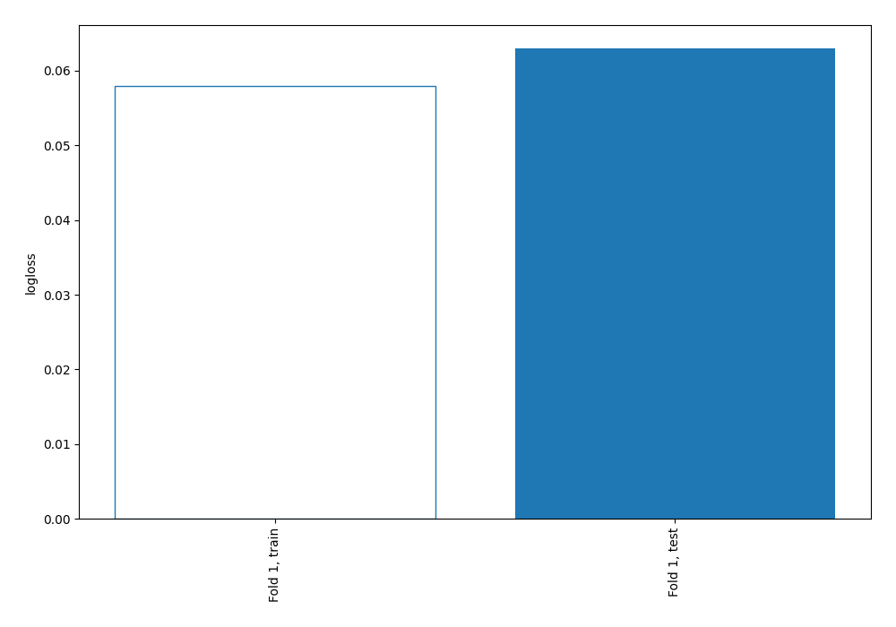
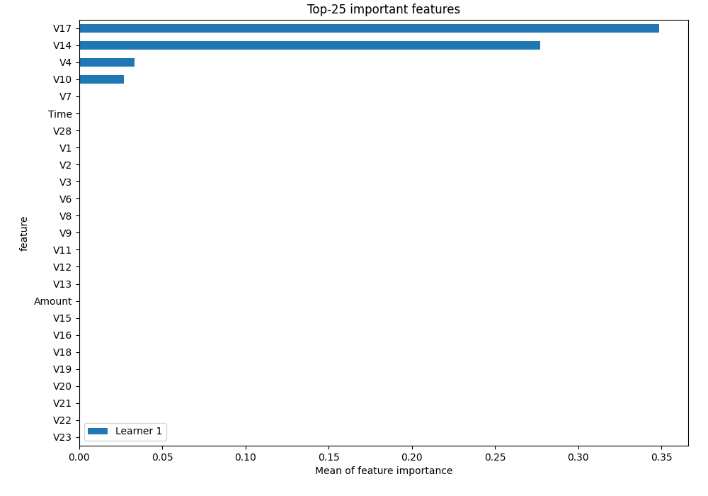
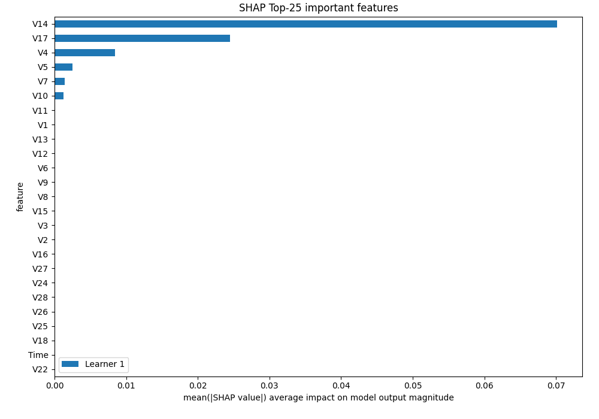
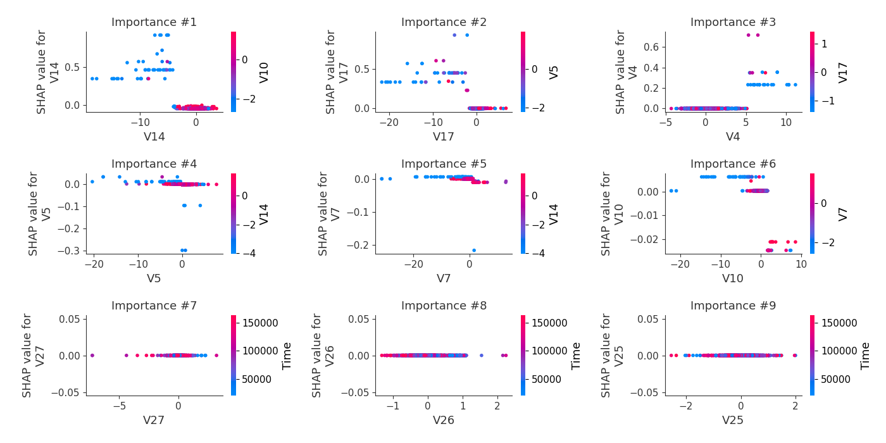
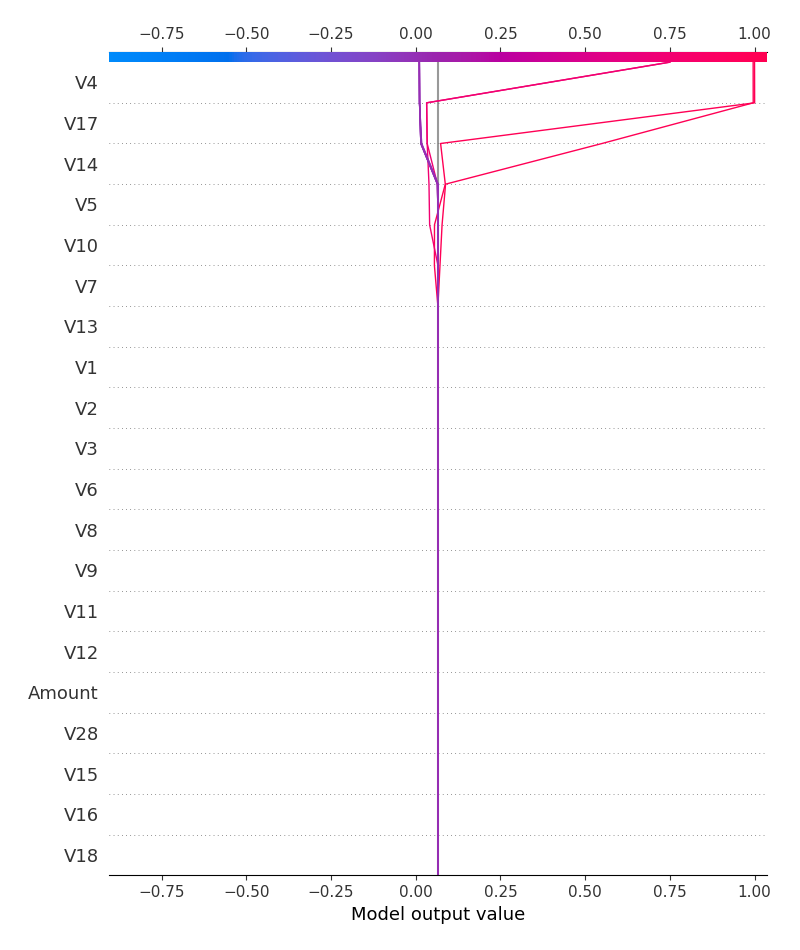
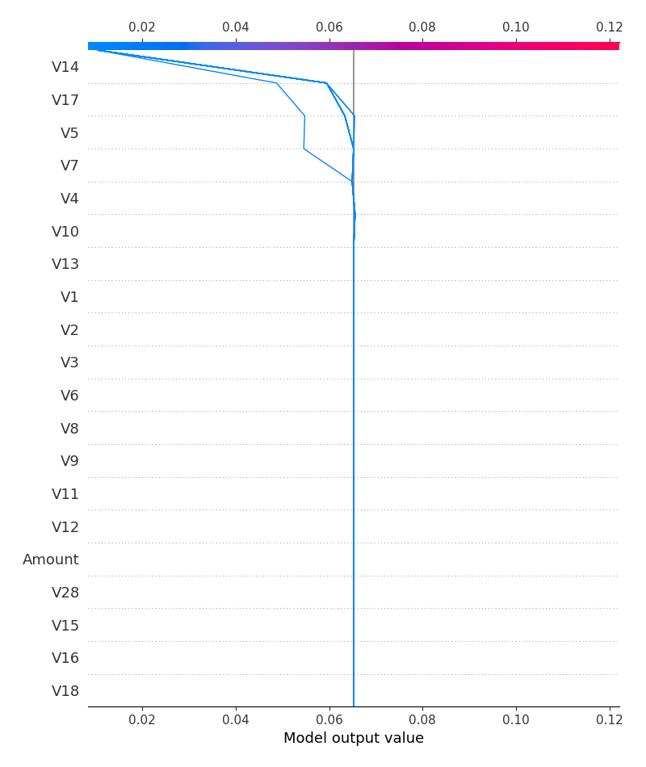
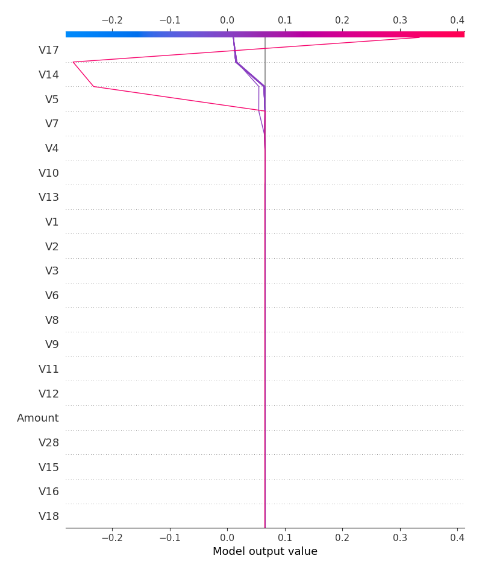

# Summary of 2_DecisionTree

## Decision Tree
- **criterion**: gini
- **max_depth**: 3
- **explain_level**: 2

## Validation
 - **validation_type**: split
 - **train_ratio**: 0.75
 - **shuffle**: True
 - **stratify**: True

## Optimized metric
logloss

## Training time

13.0 seconds

## Metric details
|           |    score |    threshold |
|:----------|---------:|-------------:|
| logloss   | 0.06295  | nan          |
| auc       | 0.935354 | nan          |
| f1        | 0.914286 |   0.010491   |
| accuracy  | 0.989324 |   0.010491   |
| precision | 0.96     |   0.010491   |
| recall    | 1        |   0.00944188 |
| mcc       | 0.90978  |   0.010491   |

## Confusion matrix (at threshold=0.010491)
|                     |   Predicted as negative |   Predicted as positive |
|:--------------------|------------------------:|------------------------:|
| Labeled as negative |                    1572 |                       4 |
| Labeled as positive |                      14 |                      96 |

## Learning curves

## Permutation-based Importance

## SHAP Importance

## SHAP Dependence plots

### Dependence (Fold #1)

## SHAP Decision plots

### Top-10 Worst decisions for class 0 (Fold #1)

### Top-10 Best decisions for class 0 (Fold #1)

### Top-10 Worst decisions for class 1 (Fold #1)

### Top-10 Best decisions for class 1 (Fold #1)
