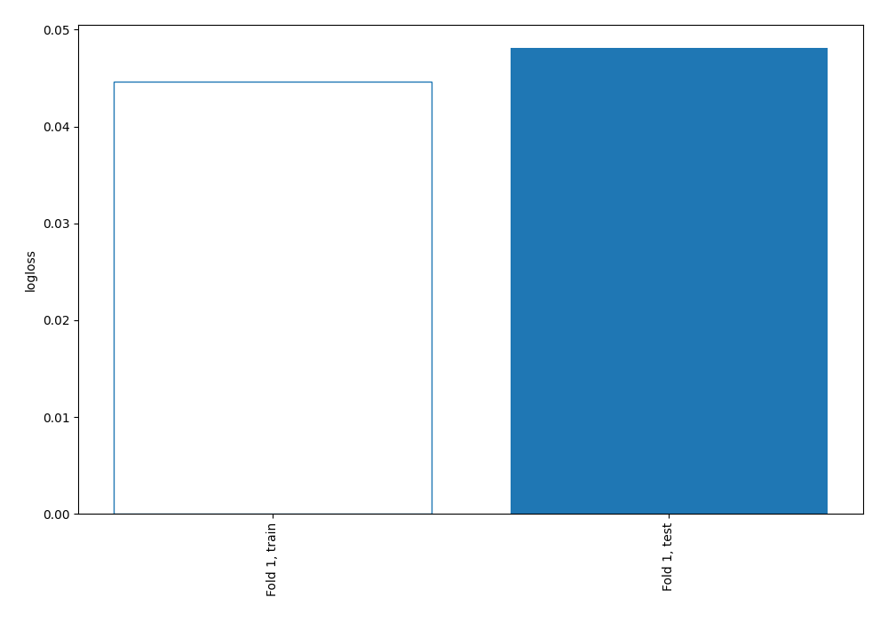
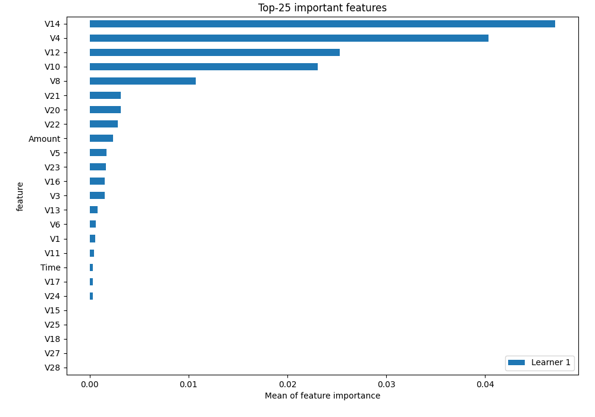
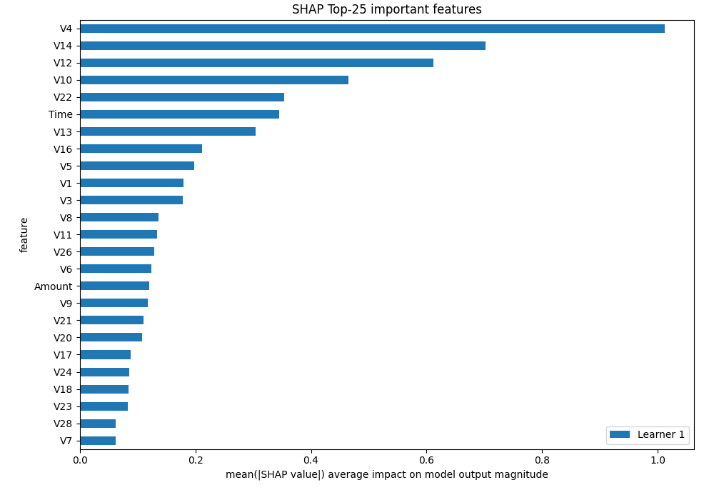
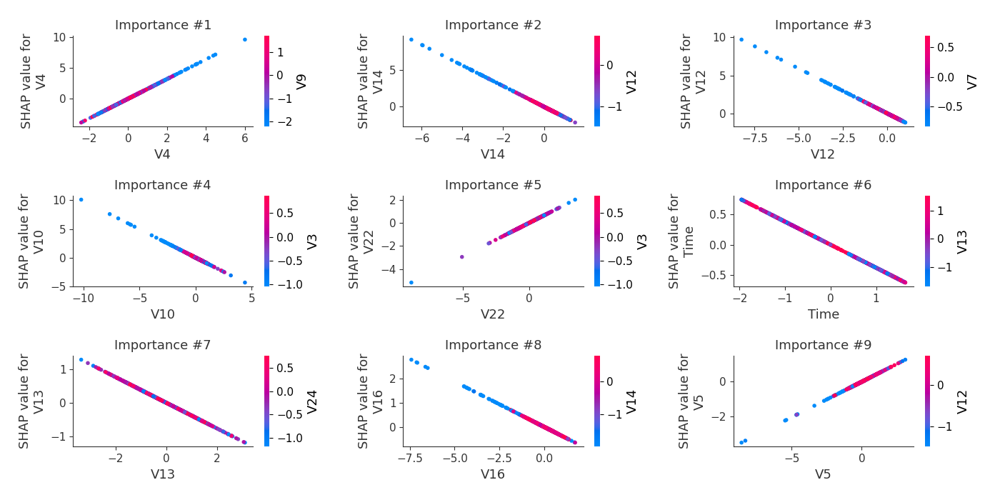
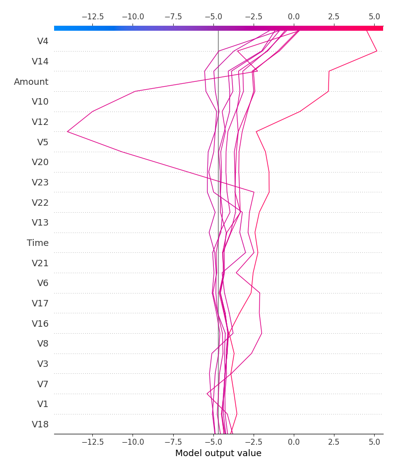
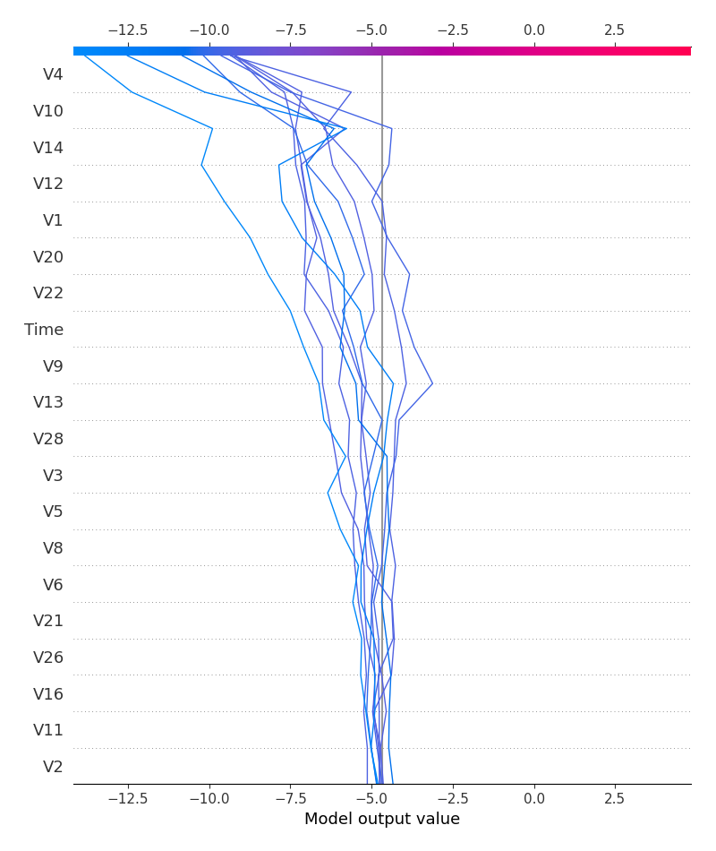
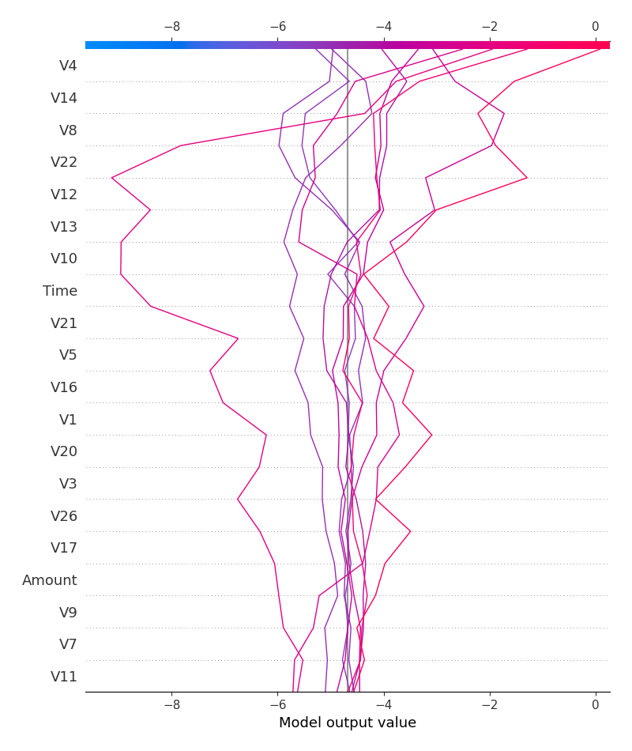
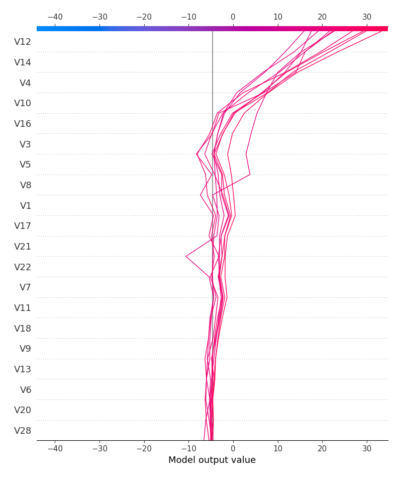

# Summary of 3_Linear

## Logistic Regression (Linear)
- **explain_level**: 2

## Validation
 - **validation_type**: split
 - **train_ratio**: 0.75
 - **shuffle**: True
 - **stratify**: True

## Optimized metric
logloss

## Training time

5.4 seconds

## Metric details
|           |    score |     threshold |
|:----------|---------:|--------------:|
| logloss   | 0.048105 | nan           |
| auc       | 0.980427 | nan           |
| f1        | 0.89083  |   0.503418    |
| accuracy  | 0.986652 |   0.503418    |
| precision | 1        |   0.999999    |
| recall    | 1        |   6.63223e-07 |
| mcc       | 0.886537 |   0.503418    |

## Confusion matrix (at threshold=0.503418)
|                     |   Predicted as negative |   Predicted as positive |
|:--------------------|------------------------:|------------------------:|
| Labeled as negative |                    1746 |                       4 |
| Labeled as positive |                      21 |                     102 |

## Learning curves

## Coefficients
| feature   |   Learner_1 |
|:----------|------------:|
| V4        |  1.59262    |
| V22       |  0.58144    |
| V28       |  0.433331   |
| V5        |  0.408002   |
| V1        |  0.317865   |
| V21       |  0.256147   |
| Amount    |  0.218952   |
| V11       |  0.197388   |
| V24       |  0.187385   |
| V7        |  0.146313   |
| V15       | -0.00725174 |
| V25       | -0.0395458  |
| V27       | -0.043617   |
| V19       | -0.0645745  |
| V2        | -0.0771912  |
| V18       | -0.10756    |
| V9        | -0.130408   |
| V6        | -0.131953   |
| V17       | -0.220302   |
| V23       | -0.261247   |
| V20       | -0.268599   |
| V26       | -0.353065   |
| V3        | -0.362026   |
| V16       | -0.374248   |
| V13       | -0.382416   |
| Time      | -0.382524   |
| V8        | -0.4562     |
| V10       | -0.993769   |
| V12       | -1.17941    |
| V14       | -1.39327    |
| intercept | -4.73819    |

## Permutation-based Importance

## SHAP Importance

## SHAP Dependence plots

### Dependence (Fold #1)

## SHAP Decision plots

### Top-10 Worst decisions for class 0 (Fold #1)

### Top-10 Best decisions for class 0 (Fold #1)

### Top-10 Worst decisions for class 1 (Fold #1)

### Top-10 Best decisions for class 1 (Fold #1)
