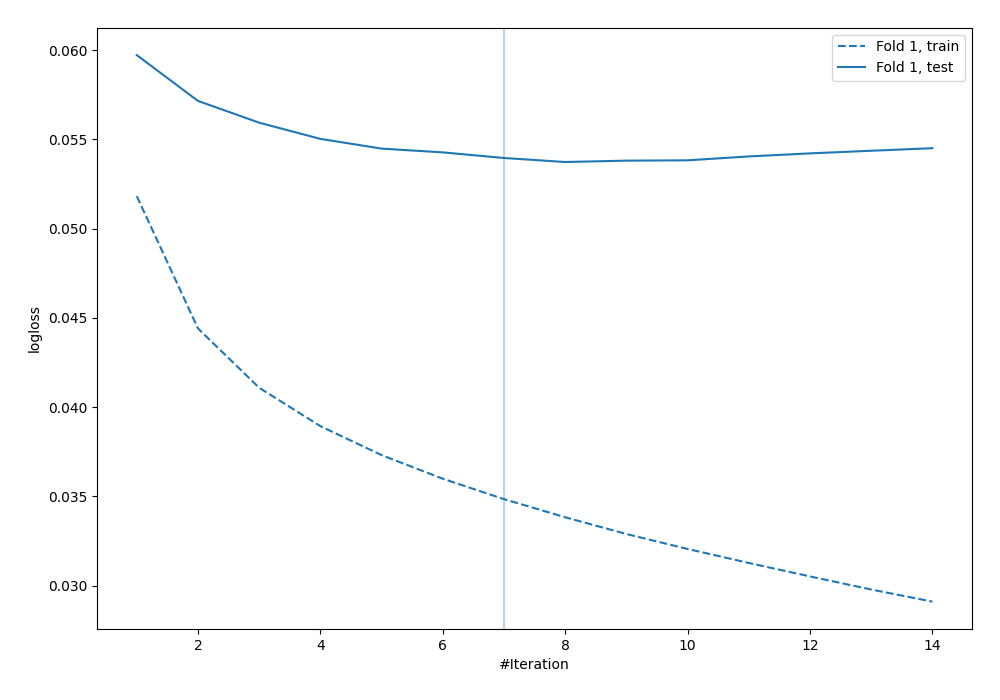

# Summary of 6_Default_NeuralNetwork

## Neural Network
- **dense_layers**: 2
- **dense_1_size**: 32
- **dense_2_size**: 16
- **dropout**: 0
- **learning_rate**: 0.05
- **momentum**: 0.9
- **decay**: 0.001
- **explain_level**: 2

## Validation
 - **validation_type**: split
 - **train_ratio**: 0.75
 - **shuffle**: True
 - **stratify**: True

## Optimized metric
logloss

## Training time

12.2 seconds

## Metric details
|           |     score |     threshold |
|:----------|----------:|--------------:|
| logloss   | 0.0537367 | nan           |
| auc       | 0.971721  | nan           |
| f1        | 0.905172  |   0.503379    |
| accuracy  | 0.988254  |   0.503379    |
| precision | 1         |   0.999413    |
| recall    | 1         |   3.26429e-08 |
| mcc       | 0.900801  |   0.503379    |

## Confusion matrix (at threshold=0.503379)
|                     |   Predicted as negative |   Predicted as positive |
|:--------------------|------------------------:|------------------------:|
| Labeled as negative |                    1746 |                       4 |
| Labeled as positive |                      18 |                     105 |

## Learning curves

## Permutation-based Importance
