## Feature : target
- **Feature type** : discrete
- **Missing** : 0.0%
- **Unique** : 2
- **Count** :7492.0
- **Mean** :0.06567004805125468
- **Std** :0.24772097946730226
- **Min** :0.0
- **25%th Percentile** : 0.0
- **50%th Percentile** : 0.0
- **75%th Percentile** : 0.0
- **Max** :1.0

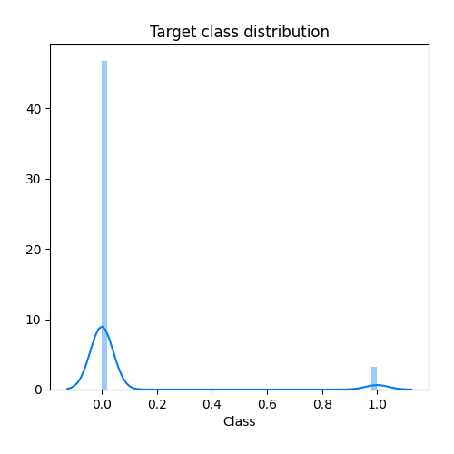
## Feature : Time
- **Feature type** : discrete
- **Missing** : 0.0%
- **Unique** : 7247
- **Count** :7492.0
- **Mean** :94181.80686065136
- **Std** :48059.68276086058
- **Min** :73.0
- **25%th Percentile** : 52624.0
- **50%th Percentile** : 84250.0
- **75%th Percentile** : 139833.25
- **Max** :172762.0

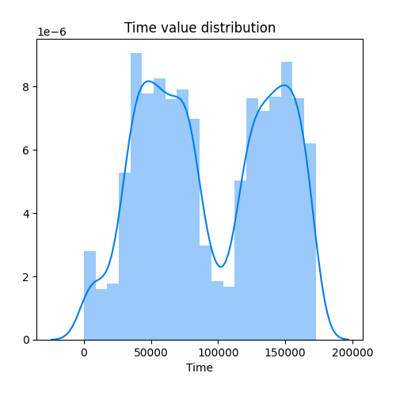
## Feature : V1
- **Feature type** : continous
- **Missing** : 0.0%
- **Unique** : 7457
- **Count** :7492.0
- **Mean** :-0.29080483148703257
- **Std** :2.7534837105834726
- **Min** :-30.55238004
- **25%th Percentile** : -1.0511039792499999
- **50%th Percentile** : -0.1177637765
- **75%th Percentile** : 1.292654834
- **Max** :2.397168334

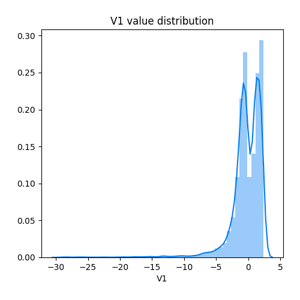
## Feature : V2
- **Feature type** : continous
- **Missing** : 0.0%
- **Unique** : 7457
- **Count** :7492.0
- **Mean** :0.23936915713448628
- **Std** :2.0301787669763747
- **Min** :-20.6604174
- **25%th Percentile** : -0.5570026469
- **50%th Percentile** : 0.11751126345
- **75%th Percentile** : 0.9001347790249999
- **Max** :22.05772899

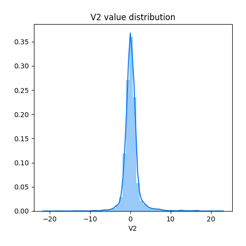
## Feature : V3
- **Feature type** : continous
- **Missing** : 0.0%
- **Unique** : 7457
- **Count** :7492.0
- **Mean** :-0.4347717543255146
- **Std** :2.8882165783740534
- **Min** :-31.10368482
- **25%th Percentile** : -1.135981939
- **50%th Percentile** : 0.09708837543
- **75%th Percentile** : 1.00298538175
- **Max** :3.824067517

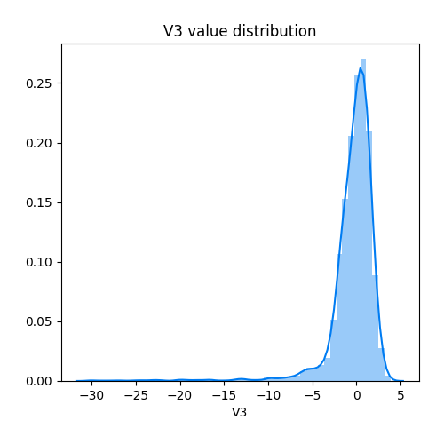
## Feature : V4
- **Feature type** : continous
- **Missing** : 0.0%
- **Unique** : 7457
- **Count** :7492.0
- **Mean** :0.2998977046865298
- **Std** :1.8945920789547412
- **Min** :-4.510141328
- **25%th Percentile** : -0.777034185975
- **50%th Percentile** : 0.093517042055
- **75%th Percentile** : 0.9388801905499999
- **Max** :12.11467184

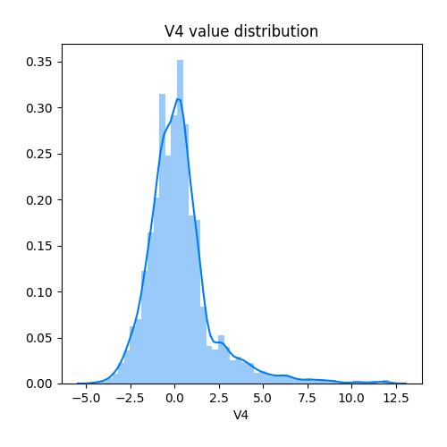
## Feature : V5
- **Feature type** : continous
- **Missing** : 0.0%
- **Unique** : 7457
- **Count** :7492.0
- **Mean** :-0.2004889370362311
- **Std** :2.005864372227091
- **Min** :-22.10553152
- **25%th Percentile** : -0.76998256745
- **50%th Percentile** : -0.09124915546000001
- **75%th Percentile** : 0.5780927971
- **Max** :14.50615033

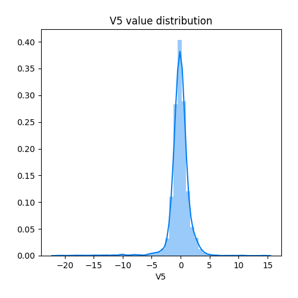
## Feature : V6
- **Feature type** : continous
- **Missing** : 0.0%
- **Unique** : 7457
- **Count** :7492.0
- **Mean** :-0.09884625305054494
- **Std** :1.3755970765488614
- **Min** :-11.65663233
- **25%th Percentile** : -0.83118929865
- **50%th Percentile** : -0.30656686904999997
- **75%th Percentile** : 0.36385866565
- **Max** :11.0255399

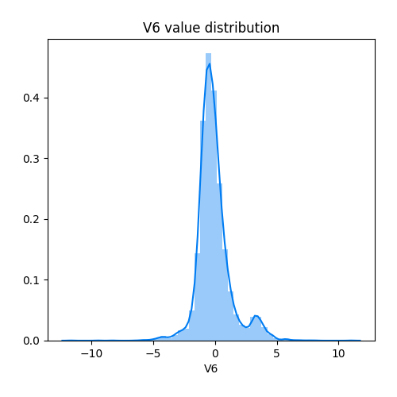
## Feature : V7
- **Feature type** : continous
- **Missing** : 0.0%
- **Unique** : 7457
- **Count** :7492.0
- **Mean** :-0.36774284837525184
- **Std** :2.5406827115176105
- **Min** :-43.55724157
- **25%th Percentile** : -0.648983986425
- **50%th Percentile** : -0.0089778620355
- **75%th Percentile** : 0.537791860875
- **Max** :25.97105848

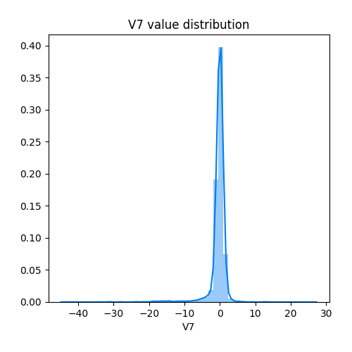
## Feature : V8
- **Feature type** : continous
- **Missing** : 0.0%
- **Unique** : 7457
- **Count** :7492.0
- **Mean** :0.03293406379860741
- **Std** :2.0881381389750904
- **Min** :-41.04426092
- **25%th Percentile** : -0.20980673574999997
- **50%th Percentile** : 0.038341009435000004
- **75%th Percentile** : 0.366946523625
- **Max** :20.00720837

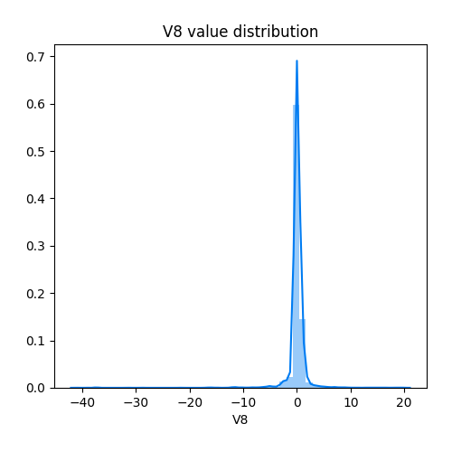
## Feature : V9
- **Feature type** : continous
- **Missing** : 0.0%
- **Unique** : 7457
- **Count** :7492.0
- **Mean** :-0.17765270798328628
- **Std** :1.3683237028688398
- **Min** :-13.43406632
- **25%th Percentile** : -0.764675678675
- **50%th Percentile** : -0.10589656595
- **75%th Percentile** : 0.564357439375
- **Max** :7.14068381

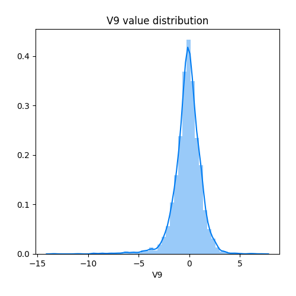
## Feature : V10
- **Feature type** : continous
- **Missing** : 0.0%
- **Unique** : 7457
- **Count** :7492.0
- **Mean** :-0.3646984153067736
- **Std** :2.1100777847474075
- **Min** :-24.58826244
- **25%th Percentile** : -0.6323942220750001
- **50%th Percentile** : -0.13266539230000002
- **75%th Percentile** : 0.4237451702
- **Max** :10.56235659

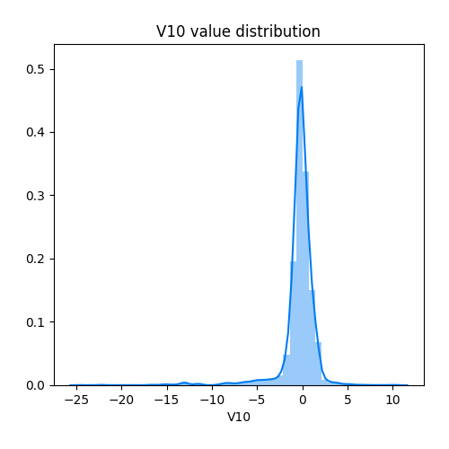
## Feature : V11
- **Feature type** : continous
- **Missing** : 0.0%
- **Unique** : 7457
- **Count** :7492.0
- **Mean** :0.260644183819888
- **Std** :1.50774756733203
- **Min** :-2.965393691
- **25%th Percentile** : -0.68698013605
- **50%th Percentile** : 0.062193042165000004
- **75%th Percentile** : 0.889666608175
- **Max** :12.01891318

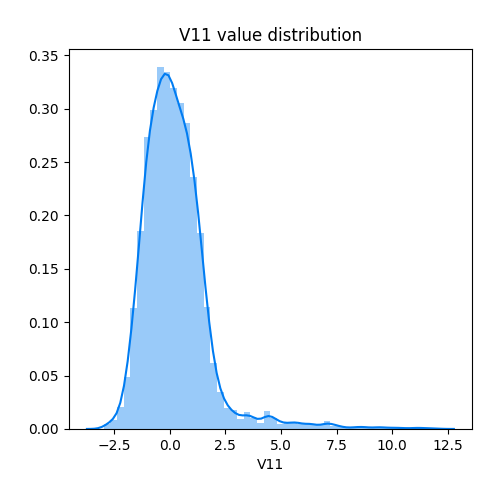
## Feature : V12
- **Feature type** : continous
- **Missing** : 0.0%
- **Unique** : 7457
- **Count** :7492.0
- **Mean** :-0.3939206443318686
- **Std** :2.1576615392607006
- **Min** :-18.68371463
- **25%th Percentile** : -0.535852157525
- **50%th Percentile** : 0.088859984585
- **75%th Percentile** : 0.58896903785
- **Max** :4.147804343

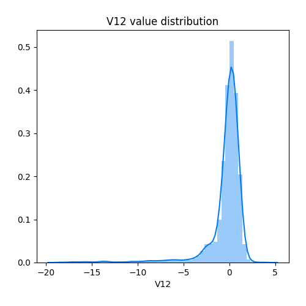
## Feature : V13
- **Feature type** : continous
- **Missing** : 0.0%
- **Unique** : 7457
- **Count** :7492.0
- **Mean** :-0.016869030984279793
- **Std** :0.9979648029955531
- **Min** :-3.76627374
- **25%th Percentile** : -0.66932853165
- **50%th Percentile** : -0.036063066645
- **75%th Percentile** : 0.6343387363749999
- **Max** :3.601670359

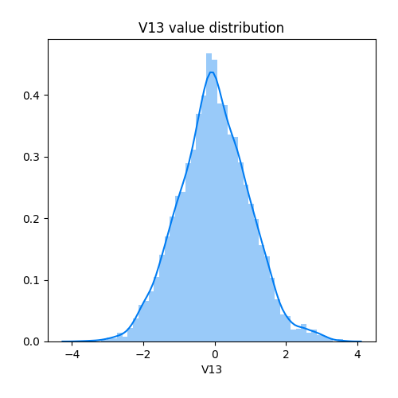
## Feature : V14
- **Feature type** : continous
- **Missing** : 0.0%
- **Unique** : 7457
- **Count** :7492.0
- **Mean** :-0.4528805532549048
- **Std** :2.223389965314964
- **Min** :-19.21432549
- **25%th Percentile** : -0.5579422070500001
- **50%th Percentile** : -0.01215072104
- **75%th Percentile** : 0.449903426175
- **Max** :6.690751884

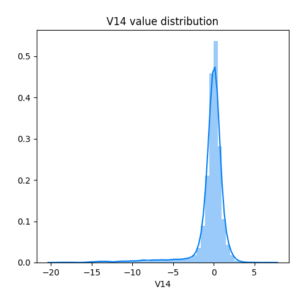
## Feature : V15
- **Feature type** : continous
- **Missing** : 0.0%
- **Unique** : 7457
- **Count** :7492.0
- **Mean** :-0.012348106773213107
- **Std** :0.9279559380339477
- **Min** :-4.498944677
- **25%th Percentile** : -0.5980661418
- **50%th Percentile** : 0.03885581908
- **75%th Percentile** : 0.64273099375
- **Max** :3.256755925

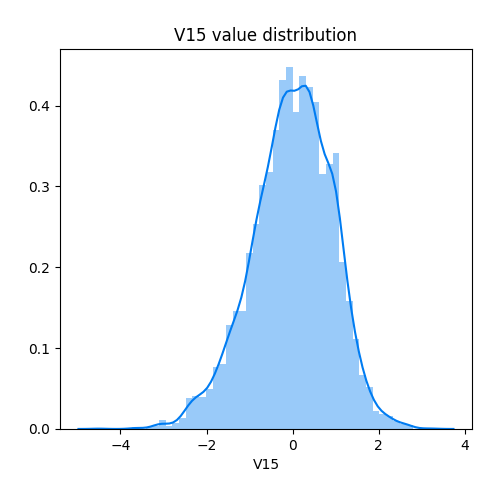
## Feature : V16
- **Feature type** : continous
- **Missing** : 0.0%
- **Unique** : 7457
- **Count** :7492.0
- **Mean** :-0.26538671181662243
- **Std** :1.6405722718141817
- **Min** :-14.12985452
- **25%th Percentile** : -0.5765614777749999
- **50%th Percentile** : 0.040893754399999996
- **75%th Percentile** : 0.50690937665
- **Max** :4.056773875

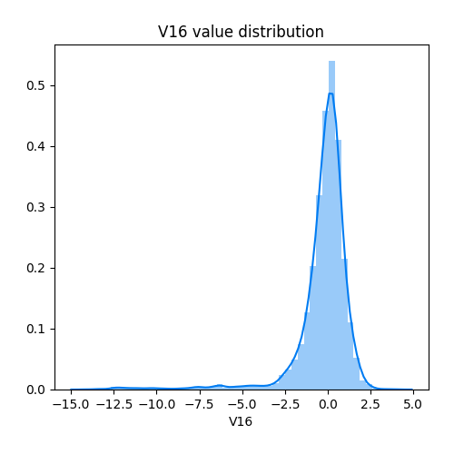
## Feature : V17
- **Feature type** : continous
- **Missing** : 0.0%
- **Unique** : 7457
- **Count** :7492.0
- **Mean** :-0.42559385808189554
- **Std** :2.538431663902414
- **Min** :-25.16279937
- **25%th Percentile** : -0.554457767925
- **50%th Percentile** : -0.10058540434999999
- **75%th Percentile** : 0.38984411457499996
- **Max** :6.739384385

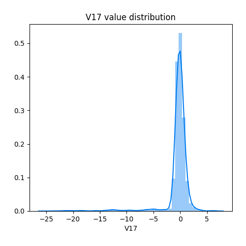
## Feature : V18
- **Feature type** : continous
- **Missing** : 0.0%
- **Unique** : 7457
- **Count** :7492.0
- **Mean** :-0.13149525257724373
- **Std** :1.2331301716355787
- **Min** :-9.498745921
- **25%th Percentile** : -0.54993474535
- **50%th Percentile** : -0.0157806289
- **75%th Percentile** : 0.5021055834
- **Max** :3.790316212

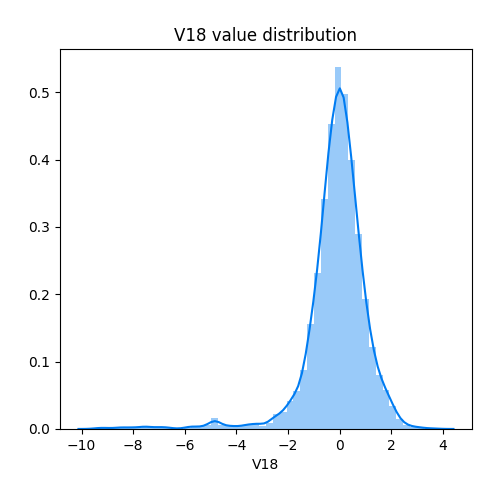
## Feature : V19
- **Feature type** : continous
- **Missing** : 0.0%
- **Unique** : 7457
- **Count** :7492.0
- **Mean** :0.039990658726772266
- **Std** :0.8916501768927272
- **Min** :-3.681903552
- **25%th Percentile** : -0.459548219775
- **50%th Percentile** : 0.01359906283
- **75%th Percentile** : 0.5061079393000001
- **Max** :5.22834179

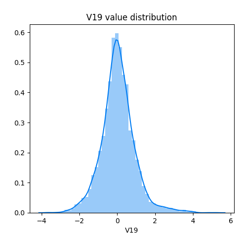
## Feature : V20
- **Feature type** : continous
- **Missing** : 0.0%
- **Unique** : 7457
- **Count** :7492.0
- **Mean** :0.01420674344150765
- **Std** :0.7832224881779685
- **Min** :-16.11670743
- **25%th Percentile** : -0.20977238285
- **50%th Percentile** : -0.056115165865
- **75%th Percentile** : 0.152812440725
- **Max** :15.27310315

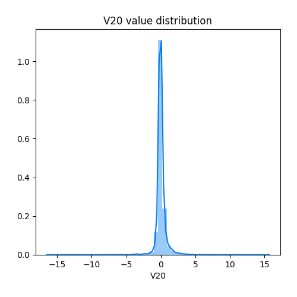
## Feature : V21
- **Feature type** : continous
- **Missing** : 0.0%
- **Unique** : 7457
- **Count** :7492.0
- **Mean** :0.04677565465208038
- **Std** :1.203189993512835
- **Min** :-22.79760391
- **25%th Percentile** : -0.216749660775
- **50%th Percentile** : -0.011456326175
- **75%th Percentile** : 0.217718008625
- **Max** :27.20283916

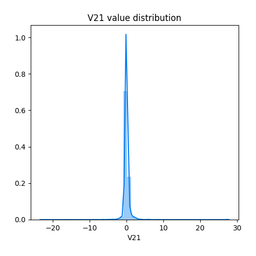
## Feature : V22
- **Feature type** : continous
- **Missing** : 0.0%
- **Unique** : 7457
- **Count** :7492.0
- **Mean** :0.007497438480975335
- **Std** :0.7920990185384171
- **Min** :-8.887017141
- **25%th Percentile** : -0.5418547516
- **50%th Percentile** : 0.017540980875
- **75%th Percentile** : 0.542894528075
- **Max** :8.361985192

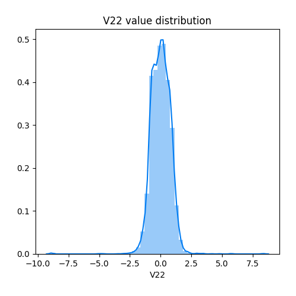
## Feature : V23
- **Feature type** : continous
- **Missing** : 0.0%
- **Unique** : 7457
- **Count** :7492.0
- **Mean** :0.013021773688257302
- **Std** :0.6671924493966078
- **Min** :-19.25432762
- **25%th Percentile** : -0.170906684925
- **50%th Percentile** : -0.0073172558995000005
- **75%th Percentile** : 0.16131913195
- **Max** :15.71995198

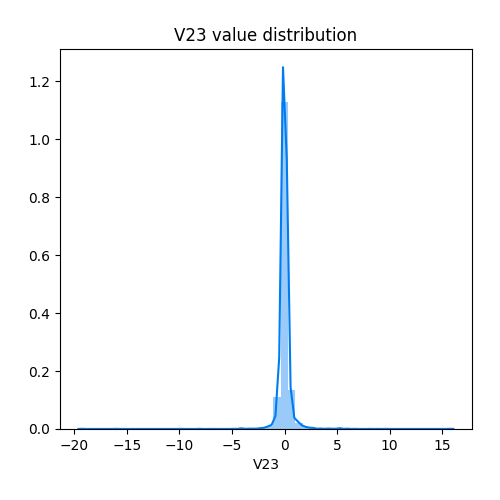
## Feature : V24
- **Feature type** : continous
- **Missing** : 0.0%
- **Unique** : 7457
- **Count** :7492.0
- **Mean** :-0.005500382004093646
- **Std** :0.5969814285929612
- **Min** :-2.51237651
- **25%th Percentile** : -0.3586349651
- **50%th Percentile** : 0.03869692642
- **75%th Percentile** : 0.42796871145000004
- **Max** :3.633398641

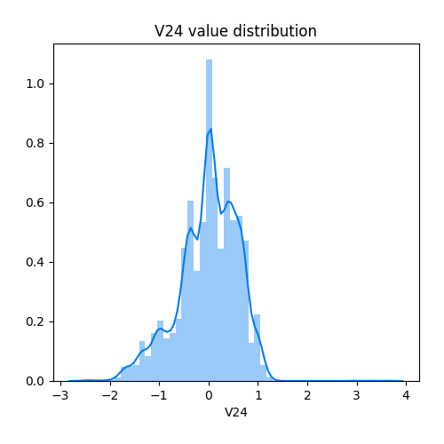
## Feature : V25
- **Feature type** : continous
- **Missing** : 0.0%
- **Unique** : 7457
- **Count** :7492.0
- **Mean** :0.0007261422016376403
- **Std** :0.5453293962514635
- **Min** :-4.781605522
- **25%th Percentile** : -0.32011236155
- **50%th Percentile** : 0.016203770399999998
- **75%th Percentile** : 0.3543880781
- **Max** :3.844345179

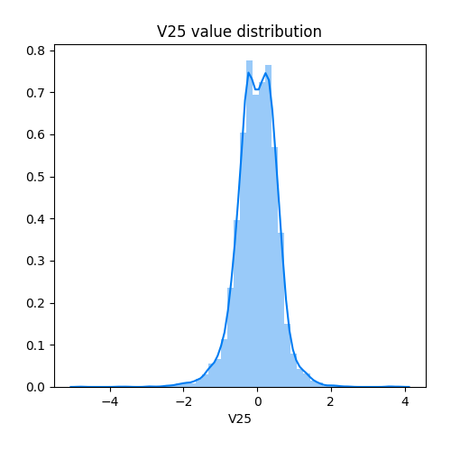
## Feature : V26
- **Feature type** : continous
- **Missing** : 0.0%
- **Unique** : 7457
- **Count** :7492.0
- **Mean** :0.01658178266535579
- **Std** :0.4816653375142555
- **Min** :-1.403084339
- **25%th Percentile** : -0.309468220275
- **50%th Percentile** : -0.034440895595
- **75%th Percentile** : 0.27396691195
- **Max** :3.155327473

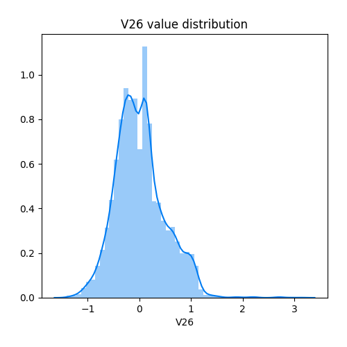
## Feature : V27
- **Feature type** : continous
- **Missing** : 0.0%
- **Unique** : 7457
- **Count** :7492.0
- **Mean** :0.012296238166018221
- **Std** :0.5076386938944722
- **Min** :-7.263482146
- **25%th Percentile** : -0.06834708469
- **50%th Percentile** : 0.004510023219000001
- **75%th Percentile** : 0.11478213500000001
- **Max** :5.018986178

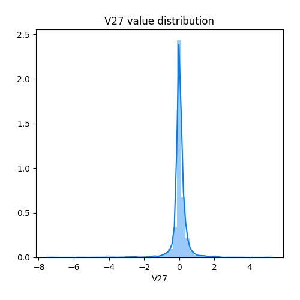
## Feature : V28
- **Feature type** : continous
- **Missing** : 0.0%
- **Unique** : 7457
- **Count** :7492.0
- **Mean** :0.004911784500804698
- **Std** :0.2830539814133934
- **Min** :-4.341194645
- **25%th Percentile** : -0.053763536880000004
- **50%th Percentile** : 0.01223619201
- **75%th Percentile** : 0.08748810125499999
- **Max** :4.420232513

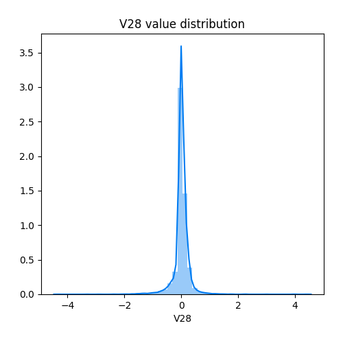
## Feature : Amount
- **Feature type** : continous
- **Missing** : 0.0%
- **Unique** : 3413
- **Count** :7492.0
- **Mean** :86.91209957287774
- **Std** :217.59277263555202
- **Min** :0.0
- **25%th Percentile** : 4.99
- **50%th Percentile** : 21.065
- **75%th Percentile** : 79.0
- **Max** :6982.67

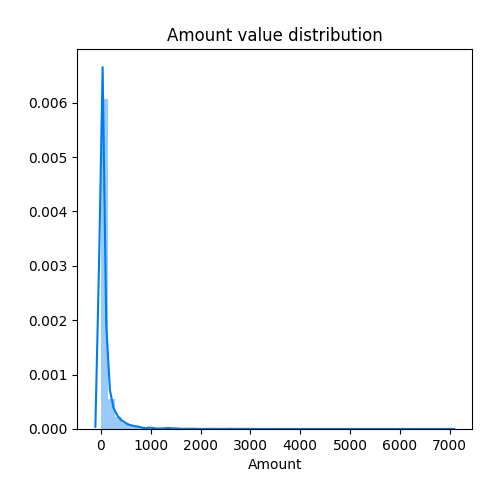
