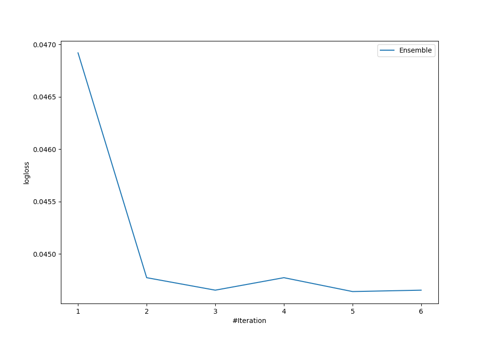

# Summary of Ensemble

## Ensemble structure
| Model             |   Weight |
|:------------------|---------:|
| 3_Linear          |        2 |
| 5_Default_Xgboost |        3 |

## Metric details
|           |     score |    threshold |
|:----------|----------:|-------------:|
| logloss   | 0.0446415 | nan          |
| auc       | 0.983401  | nan          |
| f1        | 0.917031  |   0.500612   |
| accuracy  | 0.989856  |   0.500612   |
| precision | 1         |   0.996464   |
| recall    | 1         |   0.00102092 |
| mcc       | 0.914521  |   0.500612   |

## Confusion matrix (at threshold=0.500612)
|                     |   Predicted as negative |   Predicted as positive |
|:--------------------|------------------------:|------------------------:|
| Labeled as negative |                    1749 |                       1 |
| Labeled as positive |                      18 |                     105 |

## Learning curves
