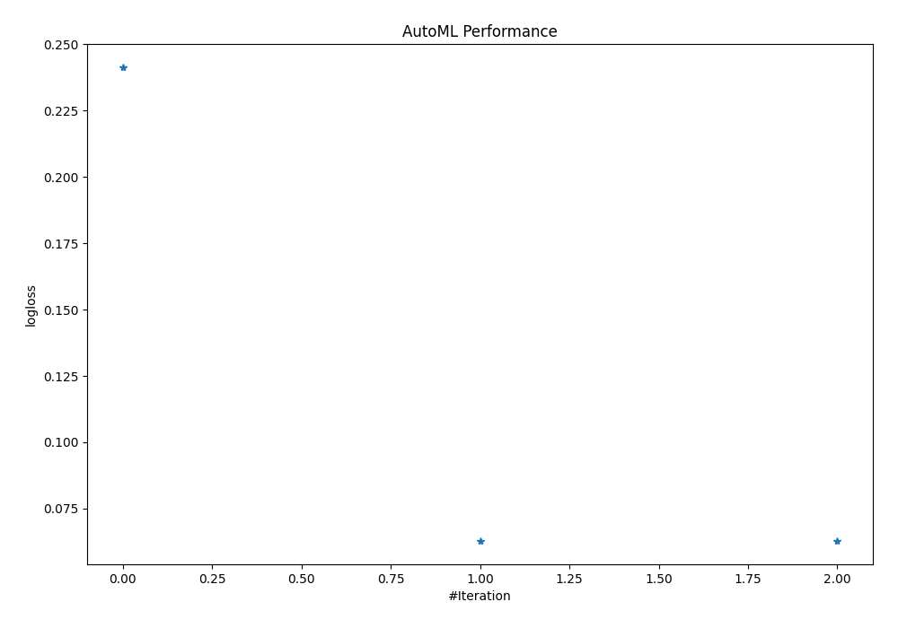
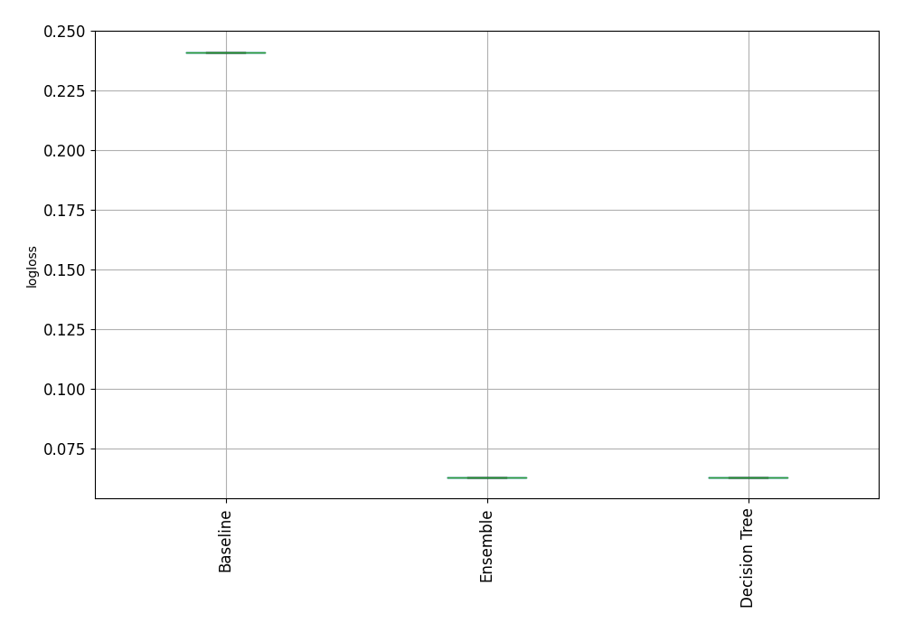

# AutoML Leaderboard

| Best model   | name           | model_type    | metric_type   |   metric_value |   train_time | Link                                     |
|:-------------|:---------------|:--------------|:--------------|---------------:|-------------:|:-----------------------------------------|
|              | 1_Baseline     | Baseline      | logloss       |       0.241157 |         0.15 | [Results link](1_Baseline/README.md)     |
| **the best** | 2_DecisionTree | Decision Tree | logloss       |       0.06295  |        13.87 | [Results link](2_DecisionTree/README.md) |
|              | Ensemble       | Ensemble      | logloss       |       0.06295  |         0.59 | [Results link](Ensemble/README.md)       |

### AutoML Performance

### AutoML Performance Boxplot
