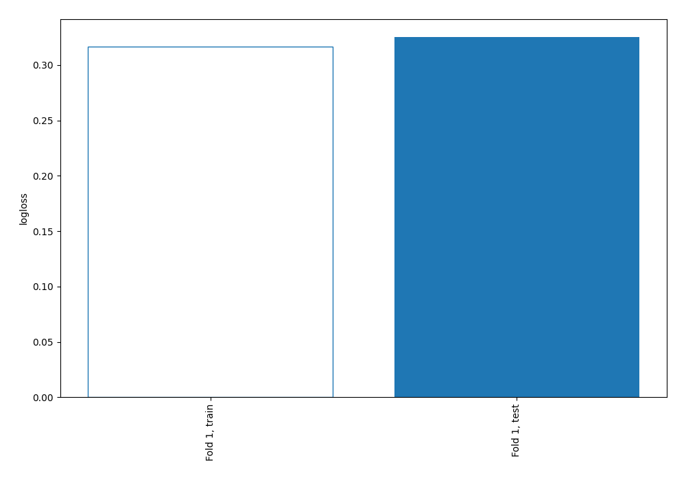
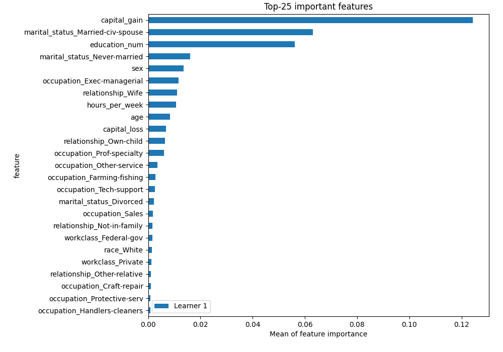
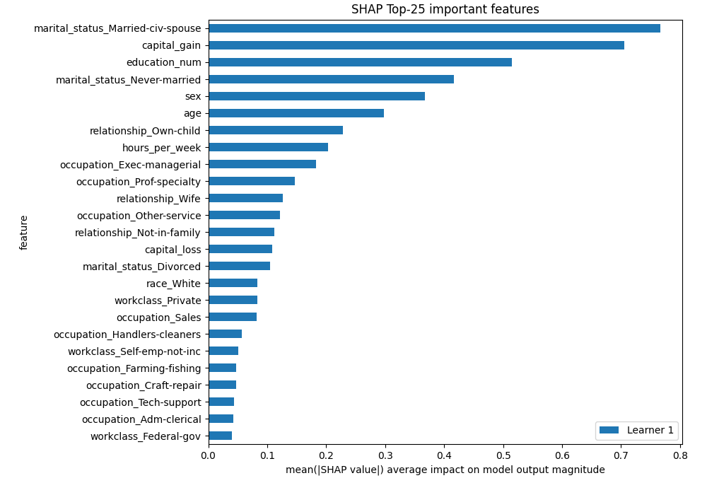
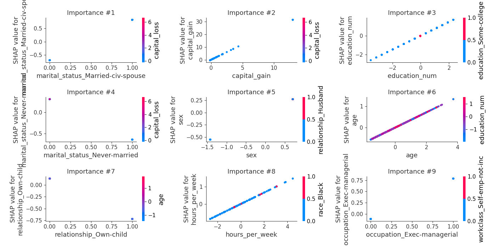
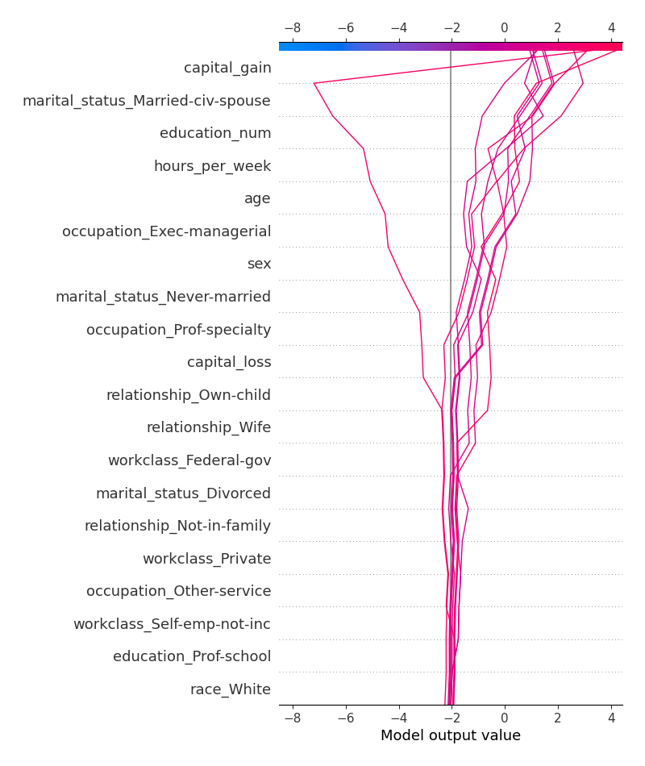
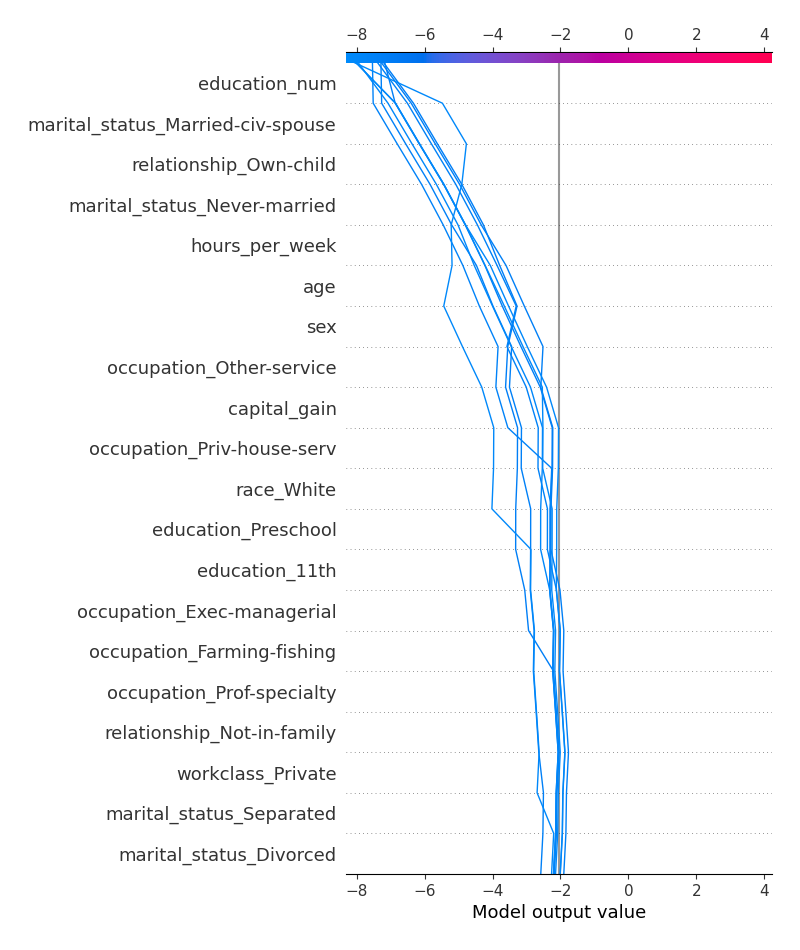
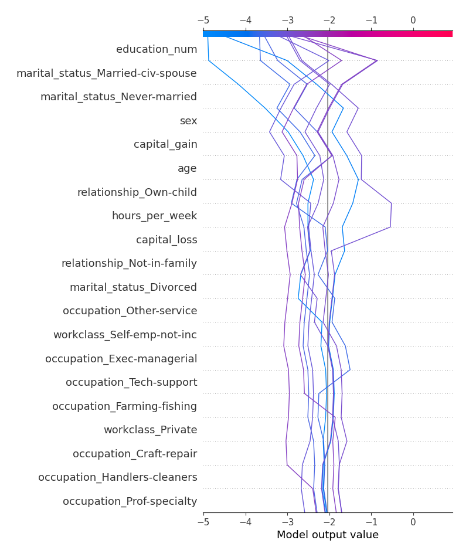
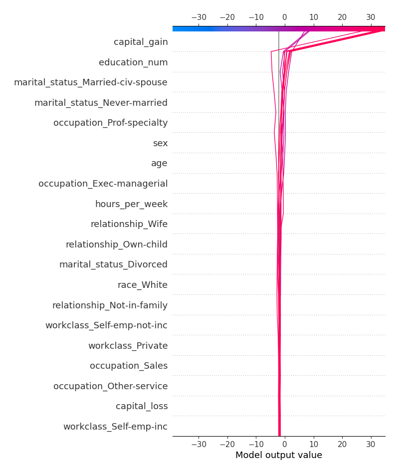

# Summary of 3_Linear

## Logistic Regression (Linear)
- **explain_level**: 2

## Validation
 - **validation_type**: split
 - **train_ratio**: 0.75
 - **shuffle**: True
 - **stratify**: True

## Optimized metric
logloss

## Training time

13.5 seconds

## Metric details
|           |    score |     threshold |
|:----------|---------:|--------------:|
| logloss   | 0.325353 | nan           |
| auc       | 0.903483 | nan           |
| f1        | 0.69054  |   0.36368     |
| accuracy  | 0.852533 |   0.497509    |
| precision | 0.882883 |   0.759682    |
| recall    | 1        |   4.26543e-05 |
| mcc       | 0.5906   |   0.39924     |

## Confusion matrix (at threshold=0.497509)
|                     |   Predicted as negative |   Predicted as positive |
|:--------------------|------------------------:|------------------------:|
| Labeled as negative |                    5050 |                     650 |
| Labeled as positive |                     508 |                    1292 |

## Learning curves

## Coefficients
| feature                              |   Learner_1 |
|:-------------------------------------|------------:|
| capital_gain                         |   2.41813   |
| marital_status_Married-civ-spouse    |   1.53853   |
| relationship_Wife                    |   1.2125    |
| marital_status_Married-AF-spouse     |   1.2104    |
| occupation_Exec-managerial           |   0.900247  |
| occupation_Protective-serv           |   0.788659  |
| occupation_Tech-support              |   0.76624   |
| education_num                        |   0.734364  |
| workclass_Federal-gov                |   0.730214  |
| occupation_Prof-specialty            |   0.654051  |
| education_1st-4th                    |   0.611938  |
| occupation_Sales                     |   0.417609  |
| workclass_Self-emp-inc               |   0.397689  |
| sex                                  |   0.387945  |
| age                                  |   0.358401  |
| education_5th-6th                    |   0.343776  |
| hours_per_week                       |   0.327142  |
| race_White                           |   0.325948  |
| relationship_Not-in-family           |   0.304555  |
| capital_loss                         |   0.259961  |
| education_Prof-school                |   0.235081  |
| education_10th                       |   0.215255  |
| occupation_Craft-repair              |   0.21119   |
| occupation_Adm-clerical              |   0.201248  |
| workclass_Private                    |   0.196569  |
| education_9th                        |   0.183366  |
| race_Black                           |   0.175468  |
| race_Asian-Pac-Islander              |   0.174839  |
| education_7th-8th                    |   0.158255  |
| education_12th                       |   0.107764  |
| education_Doctorate                  |   0.0866161 |
| occupation_Transport-moving          |   0.0794719 |
| relationship_Unmarried               |   0.0752025 |
| native_country                       |   0.0469888 |
| fnlwgt                               |   0.0435557 |
| education_Masters                    |   0.0276142 |
| workclass_Never-worked               |  -0.0117364 |
| education_Some-college               |  -0.0172528 |
| workclass_Local-gov                  |  -0.0197626 |
| education_Bachelors                  |  -0.0314351 |
| relationship_Husband                 |  -0.0514791 |
| education_Assoc-voc                  |  -0.0568143 |
| education_HS-grad                    |  -0.0652538 |
| workclass_State-gov                  |  -0.0927537 |
| occupation_Machine-op-inspct         |  -0.119166  |
| race_Amer-Indian-Eskimo              |  -0.173678  |
| workclass_                           |  -0.259934  |
| occupation_                          |  -0.271671  |
| education_11th                       |  -0.277457  |
| occupation_Armed-Forces              |  -0.326043  |
| workclass_Self-emp-not-inc           |  -0.344849  |
| education_Assoc-acdm                 |  -0.391479  |
| marital_status_Married-spouse-absent |  -0.39731   |
| marital_status_Widowed               |  -0.457068  |
| marital_status_Divorced              |  -0.460855  |
| marital_status_Separated             |  -0.504678  |
| race_Other                           |  -0.524069  |
| workclass_Without-pay                |  -0.616927  |
| occupation_Other-service             |  -0.63309   |
| occupation_Handlers-cleaners         |  -0.636084  |
| relationship_Other-relative          |  -0.70922   |
| occupation_Farming-fishing           |  -0.756443  |
| relationship_Own-child               |  -0.853052  |
| marital_status_Never-married         |  -0.950512  |
| education_Preschool                  |  -1.15147   |
| occupation_Priv-house-serv           |  -1.29771   |
| intercept                            |  -2.88159   |

## Permutation-based Importance

## SHAP Importance

## SHAP Dependence plots

### Dependence (Fold #1)

## SHAP Decision plots

### Top-10 Worst decisions for class 0 (Fold #1)

### Top-10 Best decisions for class 0 (Fold #1)

### Top-10 Worst decisions for class 1 (Fold #1)

### Top-10 Best decisions for class 1 (Fold #1)
