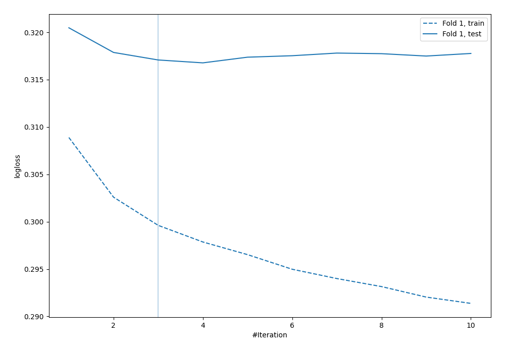
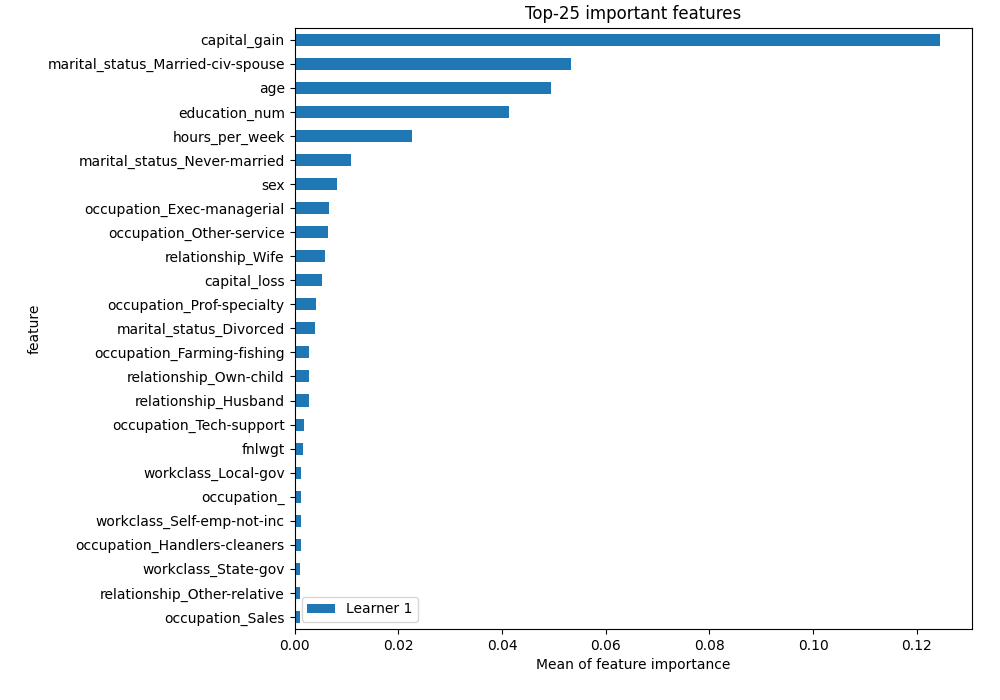

# Summary of 6_Default_NeuralNetwork

## Neural Network
- **dense_layers**: 2
- **dense_1_size**: 32
- **dense_2_size**: 16
- **dropout**: 0
- **learning_rate**: 0.05
- **momentum**: 0.9
- **decay**: 0.001
- **explain_level**: 2

## Validation
 - **validation_type**: split
 - **train_ratio**: 0.75
 - **shuffle**: True
 - **stratify**: True

## Optimized metric
logloss

## Training time

46.9 seconds

## Metric details
|           |    score |     threshold |
|:----------|---------:|--------------:|
| logloss   | 0.316772 | nan           |
| auc       | 0.90873  | nan           |
| f1        | 0.696415 |   0.372953    |
| accuracy  | 0.856133 |   0.487428    |
| precision | 0.924603 |   0.827493    |
| recall    | 1        |   1.14052e-05 |
| mcc       | 0.596891 |   0.465342    |

## Confusion matrix (at threshold=0.487428)
|                     |   Predicted as negative |   Predicted as positive |
|:--------------------|------------------------:|------------------------:|
| Labeled as negative |                    4973 |                     727 |
| Labeled as positive |                     450 |                    1350 |

## Learning curves

## Permutation-based Importance
