## Feature : target
- **Feature type** : categorical
- **Missing** : 0.0%
- **Unique** : 2
- **Count** :30000
- **Unique** :2
- **Top** :<=50K
- **Freq** :22801
- 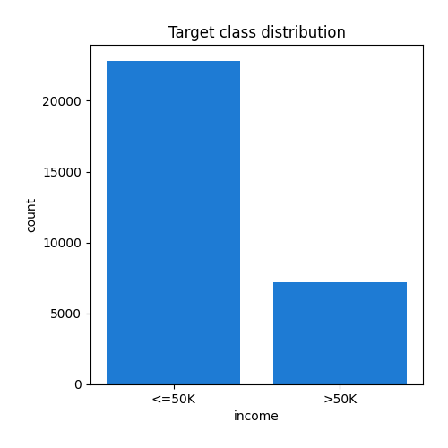
## Feature : age
- **Feature type** : discrete
- **Missing** : 0.0%
- **Unique** : 72
- **Count** :30000.0
- **Mean** :38.58246666666667
- **Std** :13.647747358049747
- **Min** :17.0
- **25%th Percentile** : 28.0
- **50%th Percentile** : 37.0
- **75%th Percentile** : 48.0
- **Max** :90.0
- 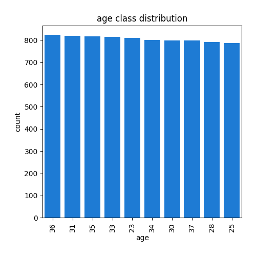
## Feature : workclass
- **Feature type** : categorical
- **Missing** : 0.0%
- **Unique** : 9
- **Count** :30000
- **Unique** :9
- **Top** :Private
- **Freq** :20901
- 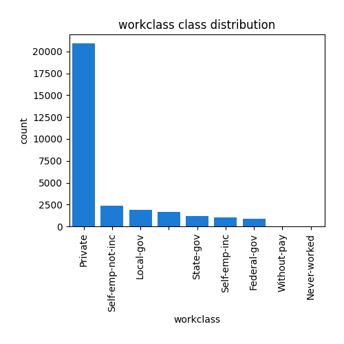
## Feature : fnlwgt
- **Feature type** : discrete
- **Missing** : 0.0%
- **Unique** : 20433
- **Count** :30000.0
- **Mean** :189767.51003333332
- **Std** :105442.01030855504
- **Min** :12285.0
- **25%th Percentile** : 117833.0
- **50%th Percentile** : 178478.0
- **75%th Percentile** : 236938.5
- **Max** :1484705.0
- 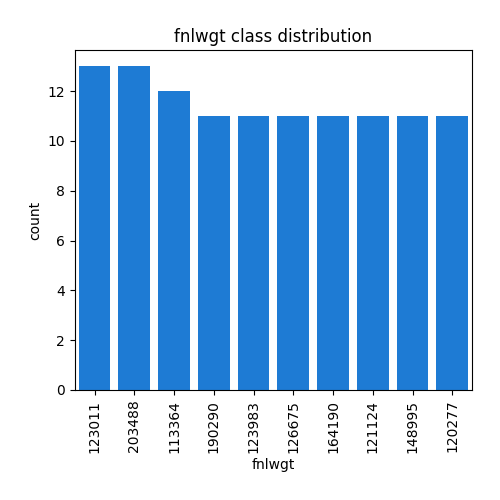
## Feature : education
- **Feature type** : categorical
- **Missing** : 0.0%
- **Unique** : 16
- **Count** :30000
- **Unique** :16
- **Top** :HS-grad
- **Freq** :9692
- 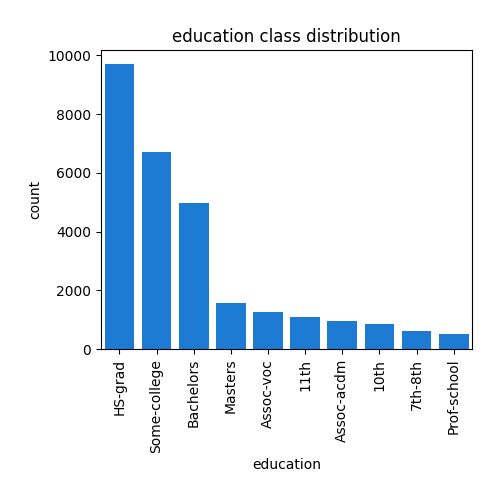
## Feature : education_num
- **Feature type** : discrete
- **Missing** : 0.0%
- **Unique** : 16
- **Count** :30000.0
- **Mean** :10.079733333333333
- **Std** :2.5722356959341943
- **Min** :1.0
- **25%th Percentile** : 9.0
- **50%th Percentile** : 10.0
- **75%th Percentile** : 12.0
- **Max** :16.0
- 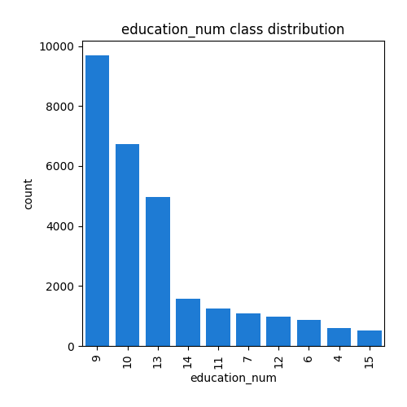
## Feature : marital_status
- **Feature type** : categorical
- **Missing** : 0.0%
- **Unique** : 7
- **Count** :30000
- **Unique** :7
- **Top** :Married-civ-spouse
- **Freq** :13768
- 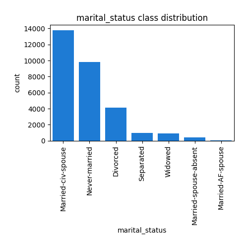
## Feature : occupation
- **Feature type** : categorical
- **Missing** : 0.0%
- **Unique** : 15
- **Count** :30000
- **Unique** :15
- **Top** :Prof-specialty
- **Freq** :3802
- 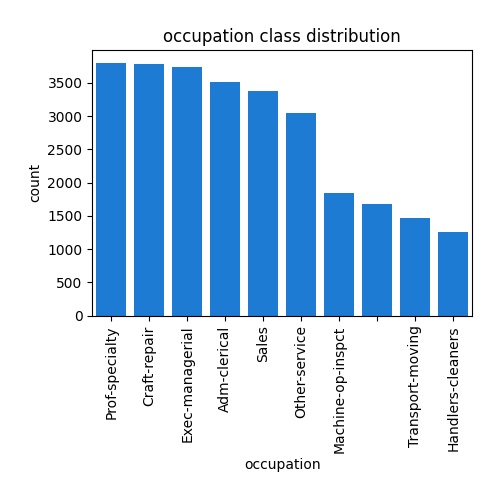
## Feature : relationship
- **Feature type** : categorical
- **Missing** : 0.0%
- **Unique** : 6
- **Count** :30000
- **Unique** :6
- **Top** :Husband
- **Freq** :12138
- 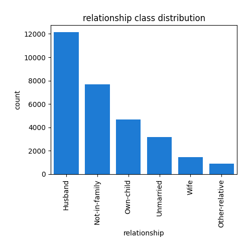
## Feature : race
- **Feature type** : categorical
- **Missing** : 0.0%
- **Unique** : 5
- **Count** :30000
- **Unique** :5
- **Top** :White
- **Freq** :25636
- 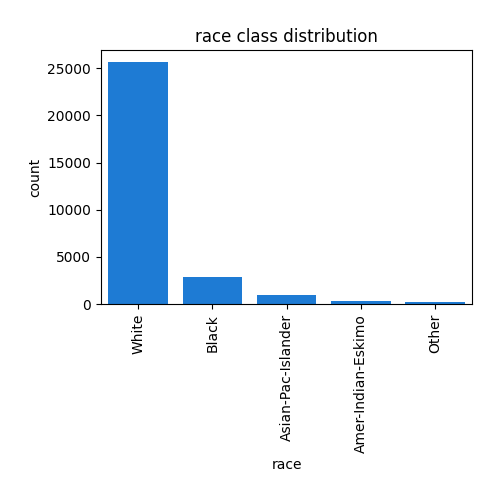
## Feature : sex
- **Feature type** : categorical
- **Missing** : 0.0%
- **Unique** : 2
- **Count** :30000
- **Unique** :2
- **Top** :Male
- **Freq** :20070
- 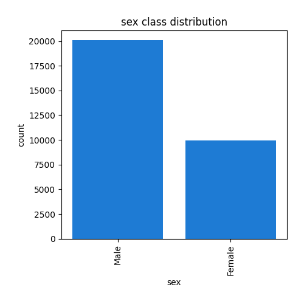
## Feature : capital_gain
- **Feature type** : discrete
- **Missing** : 0.0%
- **Unique** : 118
- **Count** :30000.0
- **Mean** :1091.6866666666667
- **Std** :7467.388819273763
- **Min** :0.0
- **25%th Percentile** : 0.0
- **50%th Percentile** : 0.0
- **75%th Percentile** : 0.0
- **Max** :99999.0
- 
## Feature : capital_loss
- **Feature type** : discrete
- **Missing** : 0.0%
- **Unique** : 91
- **Count** :30000.0
- **Mean** :86.6212
- **Std** :401.52921226336287
- **Min** :0.0
- **25%th Percentile** : 0.0
- **50%th Percentile** : 0.0
- **75%th Percentile** : 0.0
- **Max** :4356.0
- 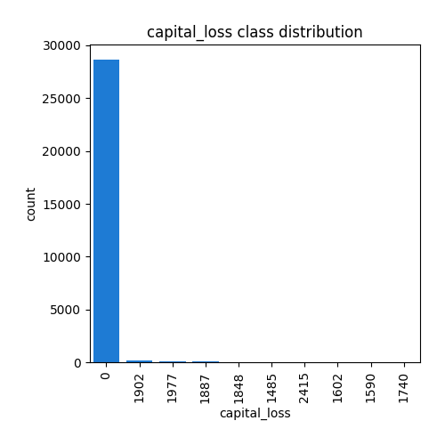
## Feature : hours_per_week
- **Feature type** : categorical
- **Missing** : 0.0%
- **Unique** : 94
- **Count** :30000
- **Unique** :94
- **Top** :40
- **Freq** :14077
- 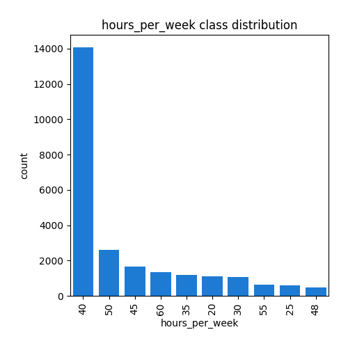
## Feature : native_country
- **Feature type** : categorical
- **Missing** : 0.0%
- **Unique** : 42
- **Count** :30000
- **Unique** :42
- **Top** :United-States
- **Freq** :26871
- 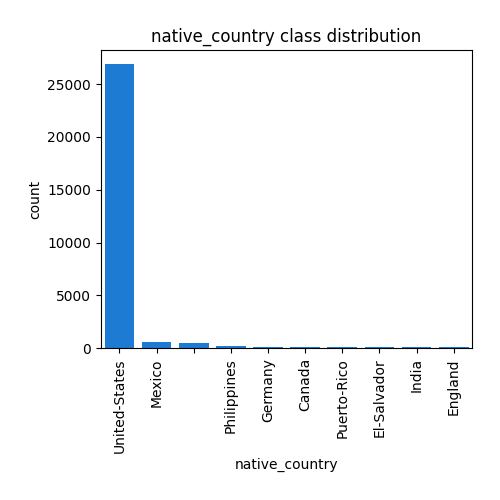
