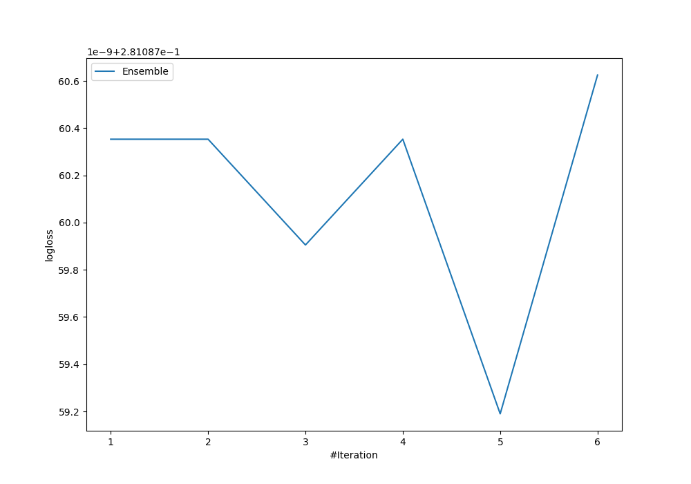

# Summary of Ensemble

## Ensemble structure
| Model             |   Weight |
|:------------------|---------:|
| 5_Default_Xgboost |        5 |

## Metric details
|           |    score |     threshold |
|:----------|---------:|--------------:|
| logloss   | 0.281087 | nan           |
| auc       | 0.925999 | nan           |
| f1        | 0.723923 |   0.385268    |
| accuracy  | 0.871733 |   0.463988    |
| precision | 0.970827 |   0.831656    |
| recall    | 1        |   3.47228e-05 |
| mcc       | 0.636445 |   0.463988    |

## Confusion matrix (at threshold=0.463988)
|                     |   Predicted as negative |   Predicted as positive |
|:--------------------|------------------------:|------------------------:|
| Labeled as negative |                    5145 |                     555 |
| Labeled as positive |                     464 |                    1336 |

## Learning curves
