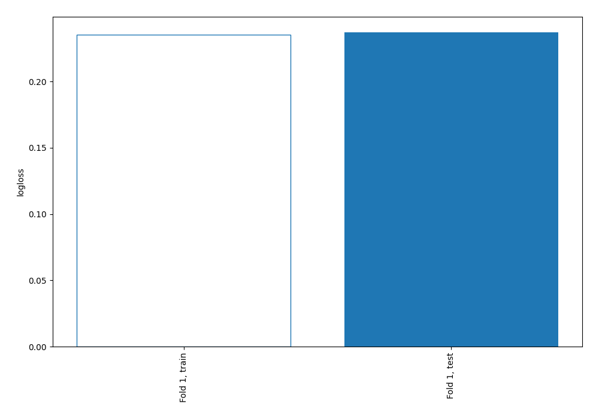
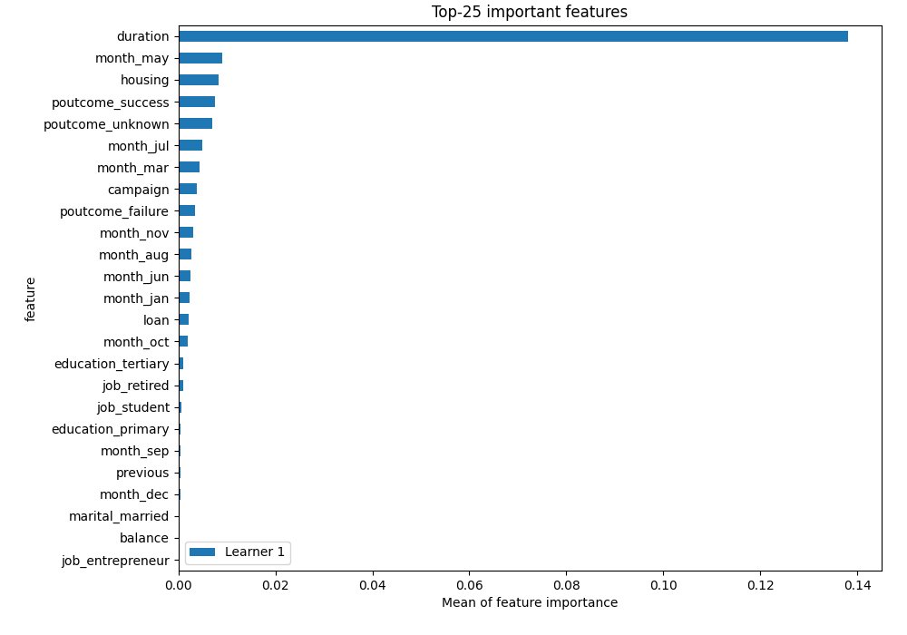
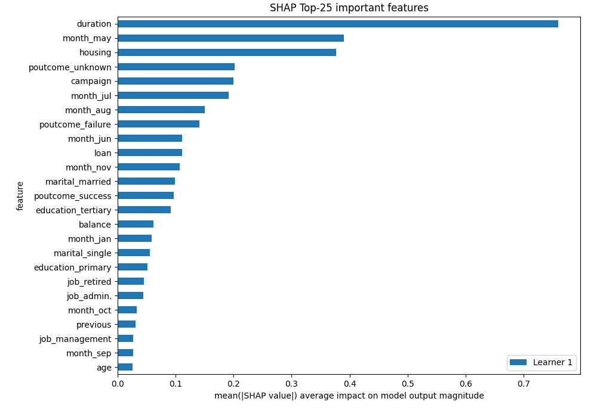
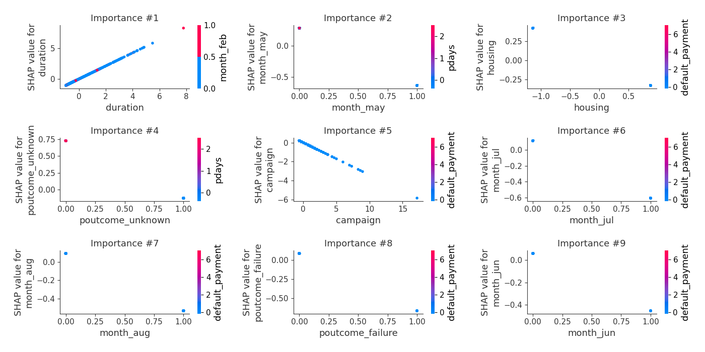
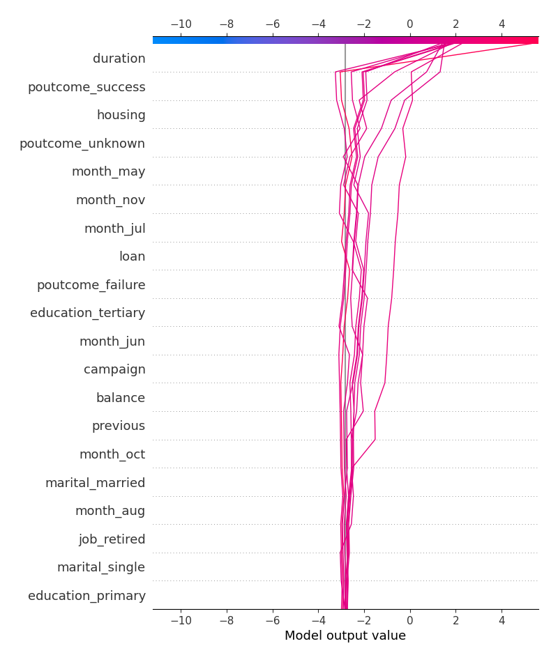
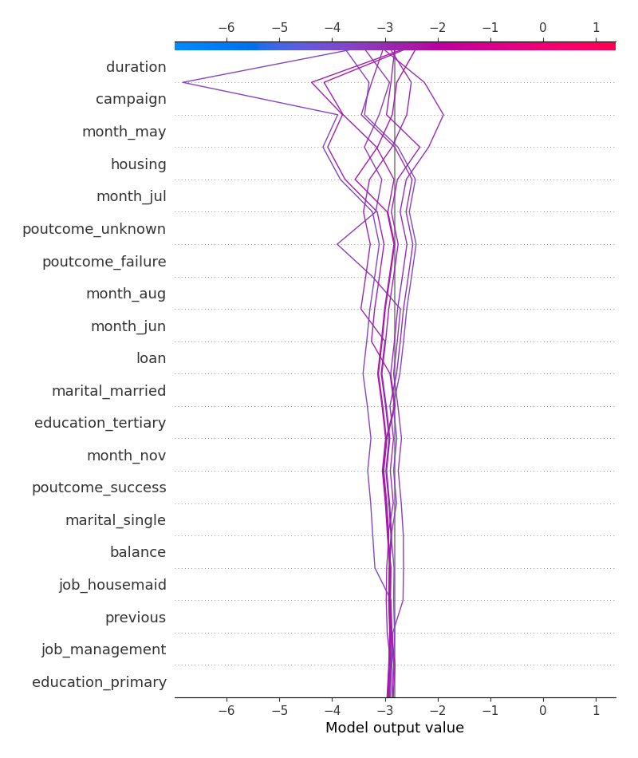
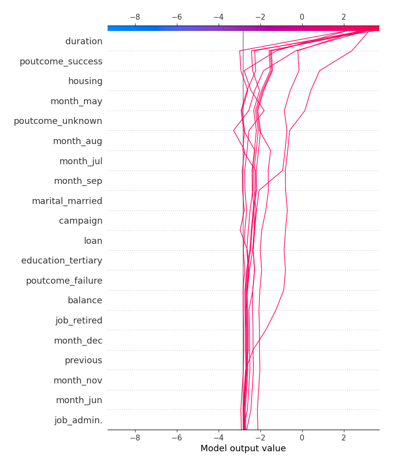

# Summary of 3_Linear

## Logistic Regression (Linear)
- **explain_level**: 2

## Validation
 - **validation_type**: split
 - **train_ratio**: 0.75
 - **shuffle**: True
 - **stratify**: True

## Optimized metric
logloss

## Training time

6.9 seconds

## Metric details
|           |    score |     threshold |
|:----------|---------:|--------------:|
| logloss   | 0.237079 | nan           |
| auc       | 0.909315 | nan           |
| f1        | 0.576568 |   0.196748    |
| accuracy  | 0.904873 |   0.41772     |
| precision | 0.690476 |   0.725813    |
| recall    | 1        |   7.20902e-05 |
| mcc       | 0.520261 |   0.196748    |

## Confusion matrix (at threshold=0.41772)
|                     |   Predicted as negative |   Predicted as positive |
|:--------------------|------------------------:|------------------------:|
| Labeled as negative |                    6625 |                     613 |
| Labeled as positive |                     305 |                     625 |

## Learning curves

## Coefficients
| feature             |   Learner_1 |
|:--------------------|------------:|
| month_mar           |  1.65158    |
| poutcome_success    |  1.60419    |
| month_sep           |  1.1394     |
| duration            |  1.07018    |
| month_oct           |  1.01796    |
| month_dec           |  0.611299   |
| job_retired         |  0.510886   |
| job_student         |  0.501499   |
| job_admin.          |  0.223268   |
| education_tertiary  |  0.219852   |
| marital_single      |  0.140699   |
| month_apr           |  0.117538   |
| balance             |  0.0868615  |
| previous            |  0.0662091  |
| marital_divorced    |  0.0613287  |
| pdays               |  0.0386297  |
| job_unemployed      |  0.0126283  |
| default_payment     |  0.0113182  |
| job_services        |  0.00392737 |
| day                 | -0.00512693 |
| education_secondary | -0.0279136  |
| age                 | -0.03124    |
| job_technician      | -0.0405243  |
| job_blue-collar     | -0.0646698  |
| month_feb           | -0.0660858  |
| job_management      | -0.0834296  |
| job_self-employed   | -0.125903   |
| loan                | -0.156764   |
| job_entrepreneur    | -0.163516   |
| education_primary   | -0.198178   |
| marital_married     | -0.208267   |
| job_housemaid       | -0.313876   |
| campaign            | -0.33998    |
| housing             | -0.374736   |
| job_other           | -0.46653    |
| month_jun           | -0.514846   |
| month_aug           | -0.623385   |
| month_nov           | -0.704296   |
| month_jul           | -0.722771   |
| poutcome_failure    | -0.752037   |
| poutcome_unknown    | -0.858394   |
| month_may           | -0.912713   |
| month_jan           | -0.999917   |
| intercept           | -1.40183    |

## Permutation-based Importance

## SHAP Importance

## SHAP Dependence plots

### Dependence (Fold #1)

## SHAP Decision plots

### Top-10 Worst decisions for class 0 (Fold #1)

### Top-10 Best decisions for class 0 (Fold #1)

### Top-10 Worst decisions for class 1 (Fold #1)

### Top-10 Best decisions for class 1 (Fold #1)
