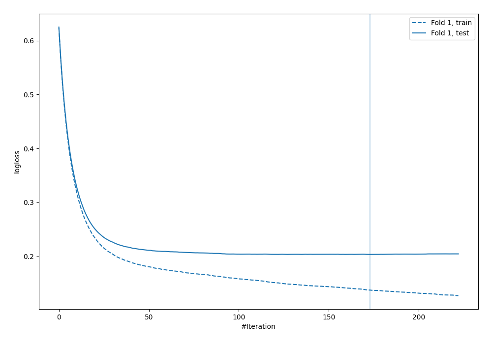
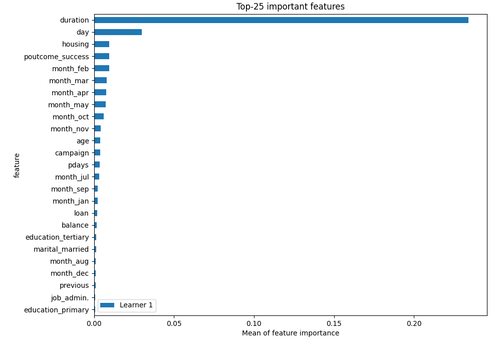
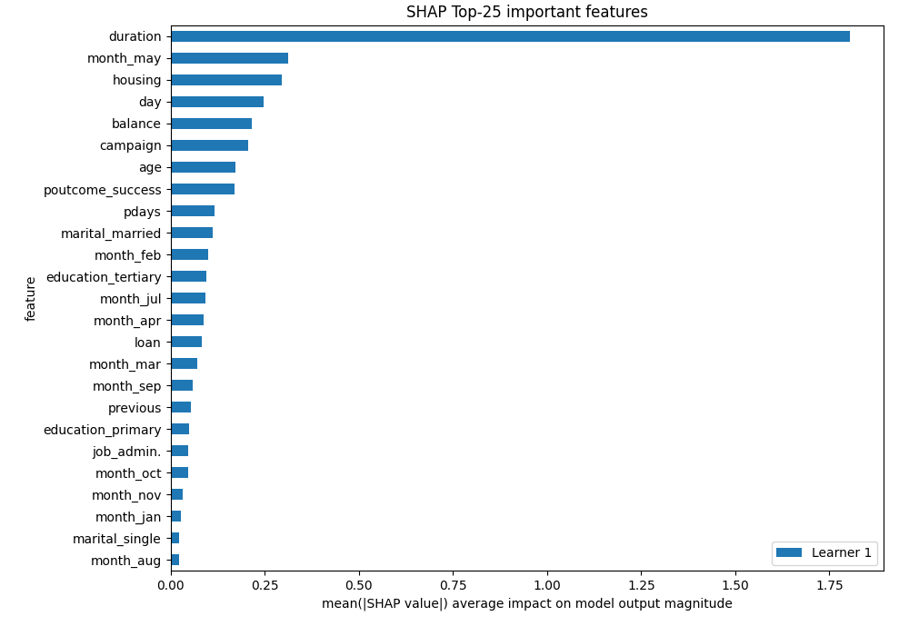
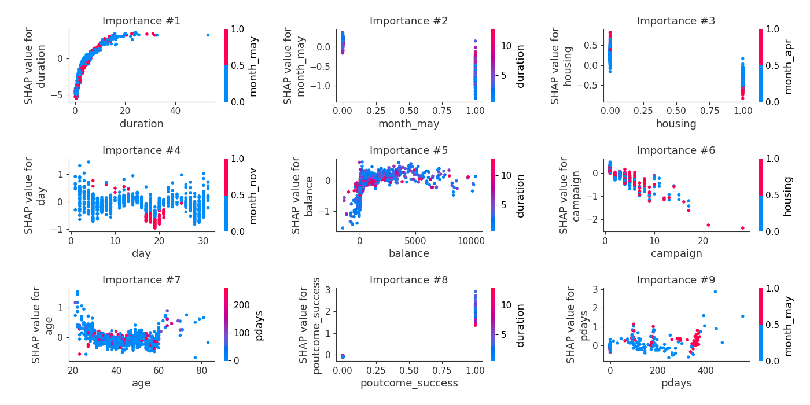
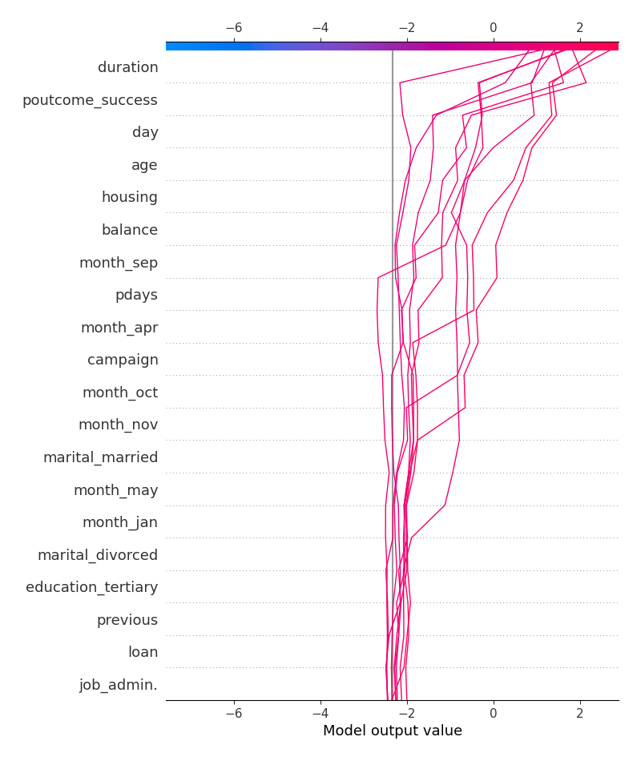
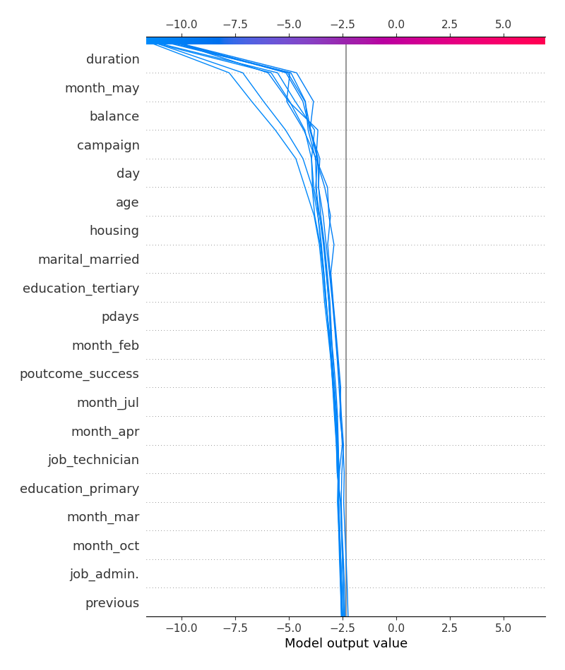
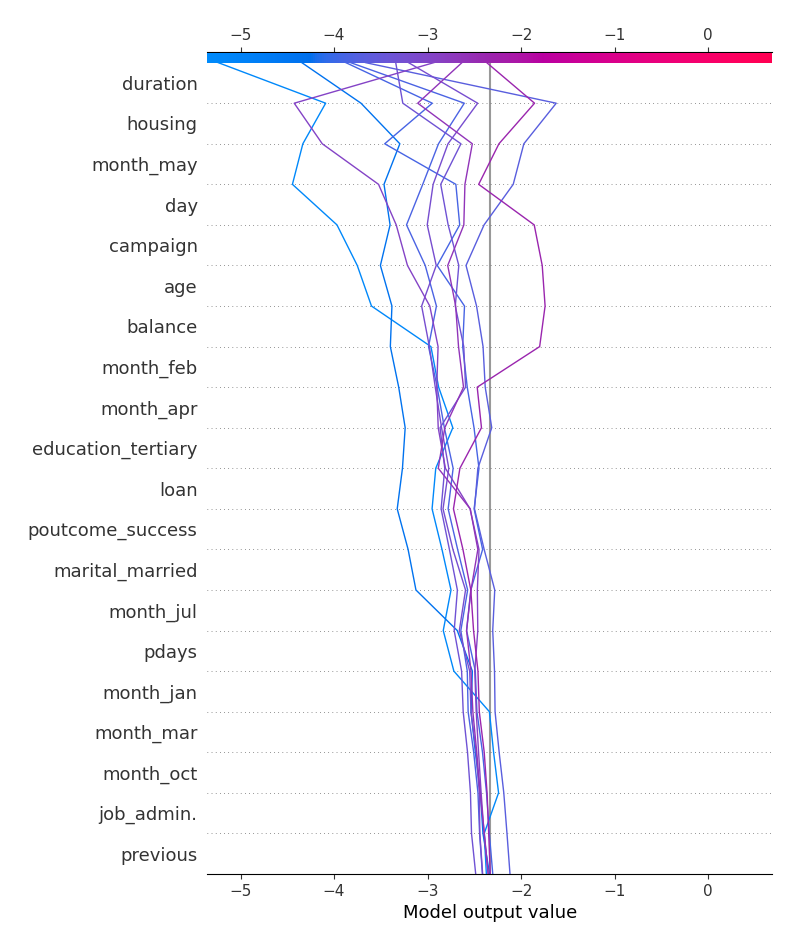
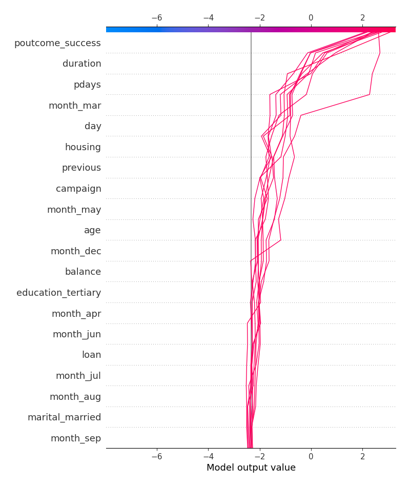

# Summary of 5_Default_Xgboost

## Extreme Gradient Boosting (Xgboost)
- **objective**: binary:logistic
- **eval_metric**: logloss
- **eta**: 0.1
- **max_depth**: 6
- **min_child_weight**: 1
- **subsample**: 1.0
- **colsample_bytree**: 1.0
- **explain_level**: 2

## Validation
 - **validation_type**: split
 - **train_ratio**: 0.75
 - **shuffle**: True
 - **stratify**: True

## Optimized metric
logloss

## Training time

9.7 seconds

## Metric details
|           |    score |    threshold |
|:----------|---------:|-------------:|
| logloss   | 0.203599 | nan          |
| auc       | 0.929142 | nan          |
| f1        | 0.618738 |   0.267802   |
| accuracy  | 0.907933 |   0.383762   |
| precision | 0.736    |   0.736979   |
| recall    | 1        |   1.8564e-05 |
| mcc       | 0.570774 |   0.188925   |

## Confusion matrix (at threshold=0.383762)
|                     |   Predicted as negative |   Predicted as positive |
|:--------------------|------------------------:|------------------------:|
| Labeled as negative |                    6679 |                     559 |
| Labeled as positive |                     263 |                     667 |

## Learning curves

## Permutation-based Importance

## SHAP Importance

## SHAP Dependence plots

### Dependence (Fold #1)

## SHAP Decision plots

### Top-10 Worst decisions for class 0 (Fold #1)

### Top-10 Best decisions for class 0 (Fold #1)

### Top-10 Worst decisions for class 1 (Fold #1)

### Top-10 Best decisions for class 1 (Fold #1)
