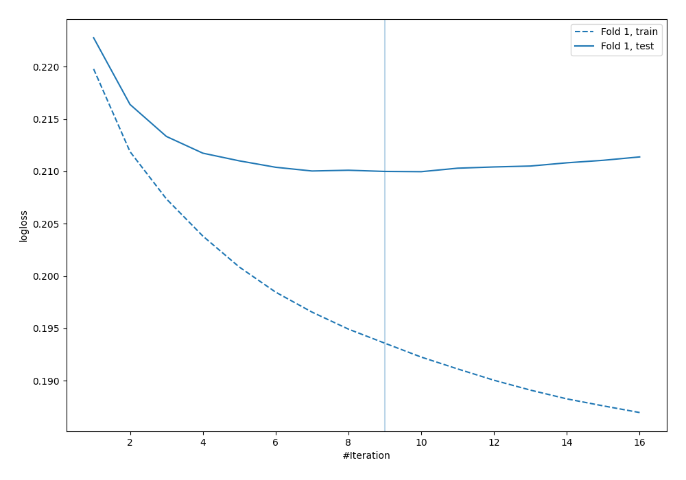
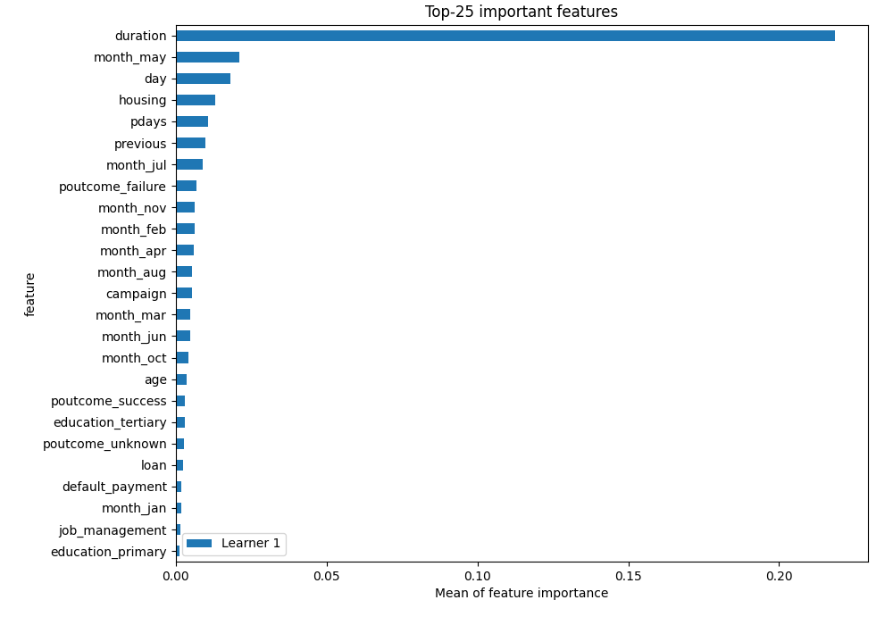

# Summary of 6_Default_NeuralNetwork

## Neural Network
- **dense_layers**: 2
- **dense_1_size**: 32
- **dense_2_size**: 16
- **dropout**: 0
- **learning_rate**: 0.05
- **momentum**: 0.9
- **decay**: 0.001
- **explain_level**: 2

## Validation
 - **validation_type**: split
 - **train_ratio**: 0.75
 - **shuffle**: True
 - **stratify**: True

## Optimized metric
logloss

## Training time

27.3 seconds

## Metric details
|           |    score |     threshold |
|:----------|---------:|--------------:|
| logloss   | 0.209968 | nan           |
| auc       | 0.920439 | nan           |
| f1        | 0.59542  |   0.240092    |
| accuracy  | 0.907199 |   0.487638    |
| precision | 0.72549  |   0.709512    |
| recall    | 1        |   5.97844e-08 |
| mcc       | 0.547381 |   0.240092    |

## Confusion matrix (at threshold=0.487638)
|                     |   Predicted as negative |   Predicted as positive |
|:--------------------|------------------------:|------------------------:|
| Labeled as negative |                    6512 |                     726 |
| Labeled as positive |                     228 |                     702 |

## Learning curves

## Permutation-based Importance
