## Feature : target
- **Feature type** : categorical
- **Missing** : 0.0%
- **Unique** : 2
- **Count** :32672
- **Unique** :2
- **Top** :no
- **Freq** :28952
- 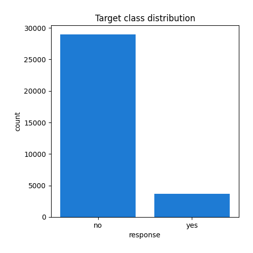
## Feature : age
- **Feature type** : discrete
- **Missing** : 0.0%
- **Unique** : 74
- **Count** :32672.0
- **Mean** :40.790768854064645
- **Std** :10.482267180879127
- **Min** :18.0
- **25%th Percentile** : 33.0
- **50%th Percentile** : 39.0
- **75%th Percentile** : 48.0
- **Max** :95.0
- 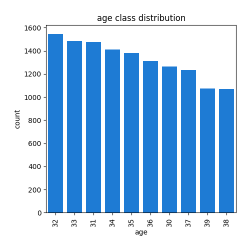
## Feature : job
- **Feature type** : categorical
- **Missing** : 0.0%
- **Unique** : 12
- **Count** :32672
- **Unique** :12
- **Top** :blue-collar
- **Freq** :7103
- 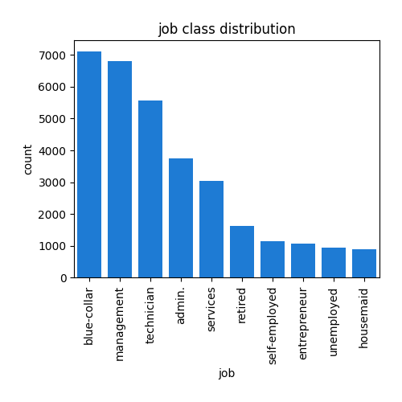
## Feature : marital
- **Feature type** : categorical
- **Missing** : 0.0%
- **Unique** : 3
- **Count** :32672
- **Unique** :3
- **Top** :married
- **Freq** :19701
- 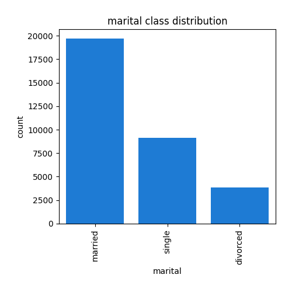
## Feature : education
- **Feature type** : categorical
- **Missing** : 0.0%
- **Unique** : 3
- **Count** :32672
- **Unique** :3
- **Top** :secondary
- **Freq** :17601
- 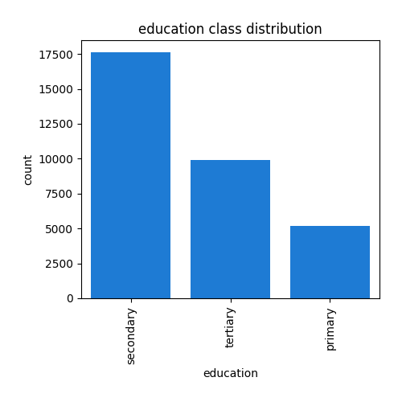
## Feature : default_payment
- **Feature type** : categorical
- **Missing** : 0.0%
- **Unique** : 2
- **Count** :32672
- **Unique** :2
- **Top** :no
- **Freq** :32049
- 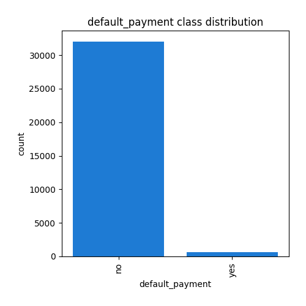
## Feature : balance
- **Feature type** : discrete
- **Missing** : 0.0%
- **Unique** : 5874
- **Count** :32672.0
- **Mean** :1067.5564091576884
- **Std** :1702.9037392211424
- **Min** :-6847.0
- **25%th Percentile** : 63.0
- **50%th Percentile** : 419.0
- **75%th Percentile** : 1328.0
- **Max** :10443.0
- 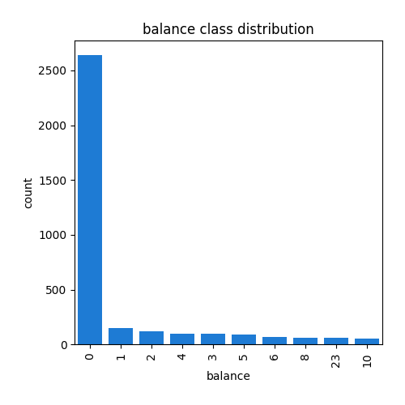
## Feature : housing
- **Feature type** : categorical
- **Missing** : 0.0%
- **Unique** : 2
- **Count** :32672
- **Unique** :2
- **Top** :yes
- **Freq** :18272
- 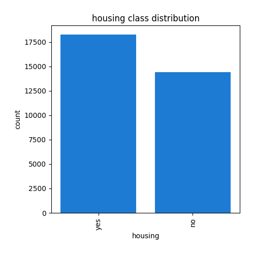
## Feature : loan
- **Feature type** : categorical
- **Missing** : 0.0%
- **Unique** : 2
- **Count** :32672
- **Unique** :2
- **Top** :no
- **Freq** :27228
- 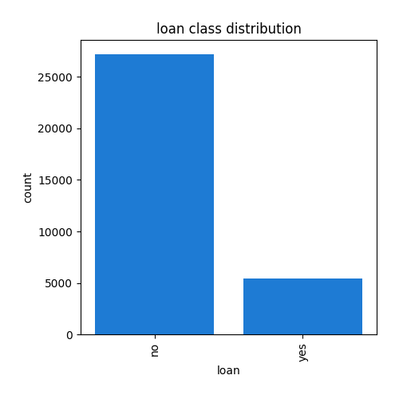
## Feature : day
- **Feature type** : discrete
- **Missing** : 0.0%
- **Unique** : 31
- **Count** :32672.0
- **Mean** :15.862389813907933
- **Std** :8.329574768162642
- **Min** :1.0
- **25%th Percentile** : 8.0
- **50%th Percentile** : 16.0
- **75%th Percentile** : 21.0
- **Max** :31.0
- 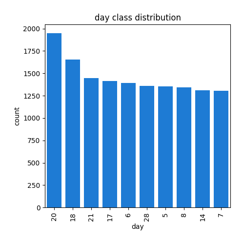
## Feature : month
- **Feature type** : categorical
- **Missing** : 0.0%
- **Unique** : 12
- **Count** :32672
- **Unique** :12
- **Top** :may
- **Freq** :9985
- 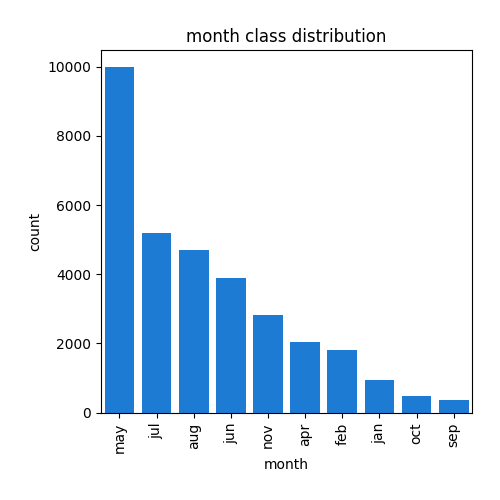
## Feature : duration
- **Feature type** : continous
- **Missing** : 0.0%
- **Unique** : 1462
- **Count** :32672.0
- **Mean** :4.309796461802155
- **Std** :4.294059097448773
- **Min** :0.1
- **25%th Percentile** : 1.73
- **50%th Percentile** : 3.02
- **75%th Percentile** : 5.32
- **Max** :81.97
- 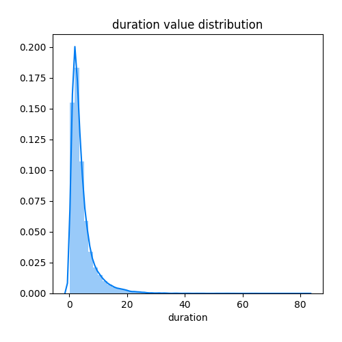
## Feature : campaign
- **Feature type** : discrete
- **Missing** : 0.0%
- **Unique** : 46
- **Count** :32672.0
- **Mean** :2.77179236043095
- **Std** :3.104460519931258
- **Min** :1.0
- **25%th Percentile** : 1.0
- **50%th Percentile** : 2.0
- **75%th Percentile** : 3.0
- **Max** :58.0
- 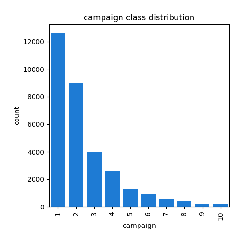
## Feature : pdays
- **Feature type** : discrete
- **Missing** : 0.0%
- **Unique** : 479
- **Count** :32672.0
- **Mean** :32.489899608227226
- **Std** :91.02451682443781
- **Min** :-1.0
- **25%th Percentile** : -1.0
- **50%th Percentile** : -1.0
- **75%th Percentile** : -1.0
- **Max** :871.0
- 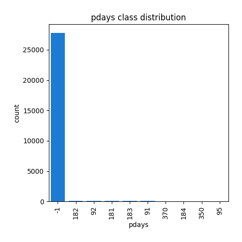
## Feature : previous
- **Feature type** : discrete
- **Missing** : 0.0%
- **Unique** : 34
- **Count** :32672.0
- **Mean** :0.4388773261508325
- **Std** :1.5630166241049799
- **Min** :0.0
- **25%th Percentile** : 0.0
- **50%th Percentile** : 0.0
- **75%th Percentile** : 0.0
- **Max** :55.0
- 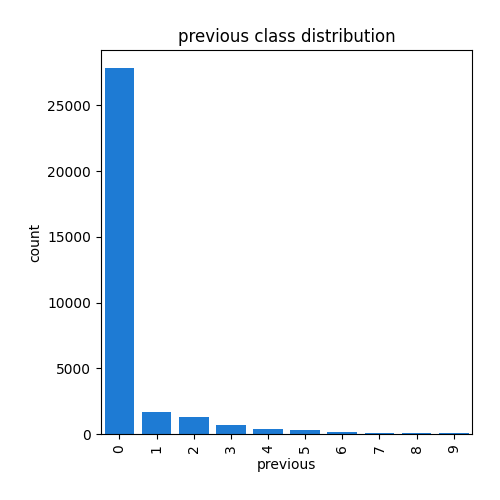
## Feature : poutcome
- **Feature type** : categorical
- **Missing** : 0.0%
- **Unique** : 3
- **Count** :32672
- **Unique** :3
- **Top** :unknown
- **Freq** :27817
- 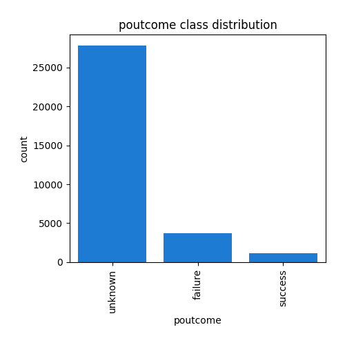
