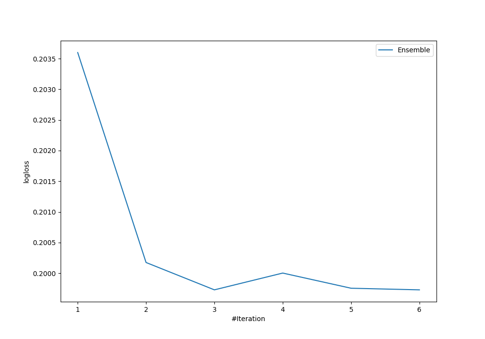

# Summary of Ensemble

## Ensemble structure
| Model                   |   Weight |
|:------------------------|---------:|
| 5_Default_Xgboost       |        4 |
| 6_Default_NeuralNetwork |        2 |

## Metric details
|           |    score |     threshold |
|:----------|---------:|--------------:|
| logloss   | 0.199728 | nan           |
| auc       | 0.930316 | nan           |
| f1        | 0.619321 |   0.249777    |
| accuracy  | 0.908546 |   0.394879    |
| precision | 0.737327 |   0.722315    |
| recall    | 1        |   1.86922e-05 |
| mcc       | 0.572715 |   0.249777    |

## Confusion matrix (at threshold=0.394879)
|                     |   Predicted as negative |   Predicted as positive |
|:--------------------|------------------------:|------------------------:|
| Labeled as negative |                    6603 |                     635 |
| Labeled as positive |                     228 |                     702 |

## Learning curves
