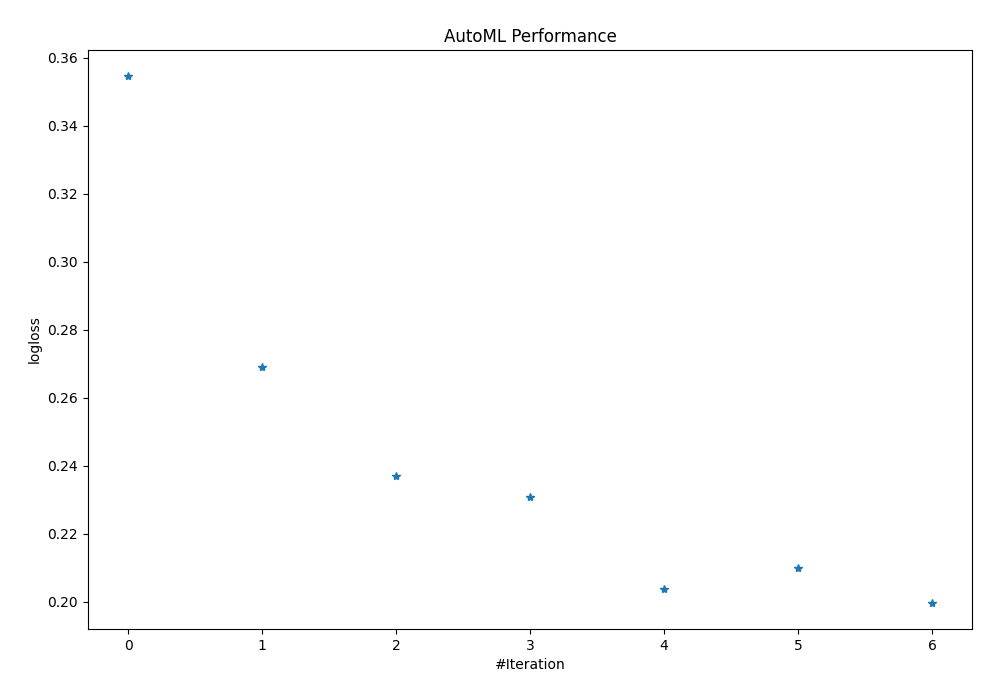
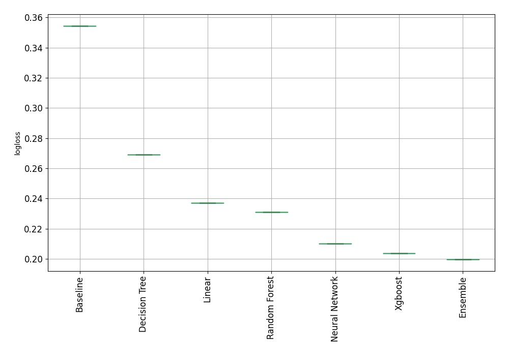

# AutoML Leaderboard

| Best model   | name                    | model_type     | metric_type   |   metric_value |   train_time | Link                                              |
|:-------------|:------------------------|:---------------|:--------------|---------------:|-------------:|:--------------------------------------------------|
|              | 1_Baseline              | Baseline       | logloss       |       0.354508 |         0.32 | [Results link](1_Baseline/README.md)              |
|              | 2_DecisionTree          | Decision Tree  | logloss       |       0.269144 |        15.8  | [Results link](2_DecisionTree/README.md)          |
|              | 3_Linear                | Linear         | logloss       |       0.237079 |         7.45 | [Results link](3_Linear/README.md)                |
|              | 4_Default_RandomForest  | Random Forest  | logloss       |       0.230933 |        14.16 | [Results link](4_Default_RandomForest/README.md)  |
|              | 5_Default_Xgboost       | Xgboost        | logloss       |       0.203599 |        10.48 | [Results link](5_Default_Xgboost/README.md)       |
|              | 6_Default_NeuralNetwork | Neural Network | logloss       |       0.209968 |        27.67 | [Results link](6_Default_NeuralNetwork/README.md) |
| **the best** | Ensemble                | Ensemble       | logloss       |       0.199728 |         1.75 | [Results link](Ensemble/README.md)                |

### AutoML Performance

### AutoML Performance Boxplot
